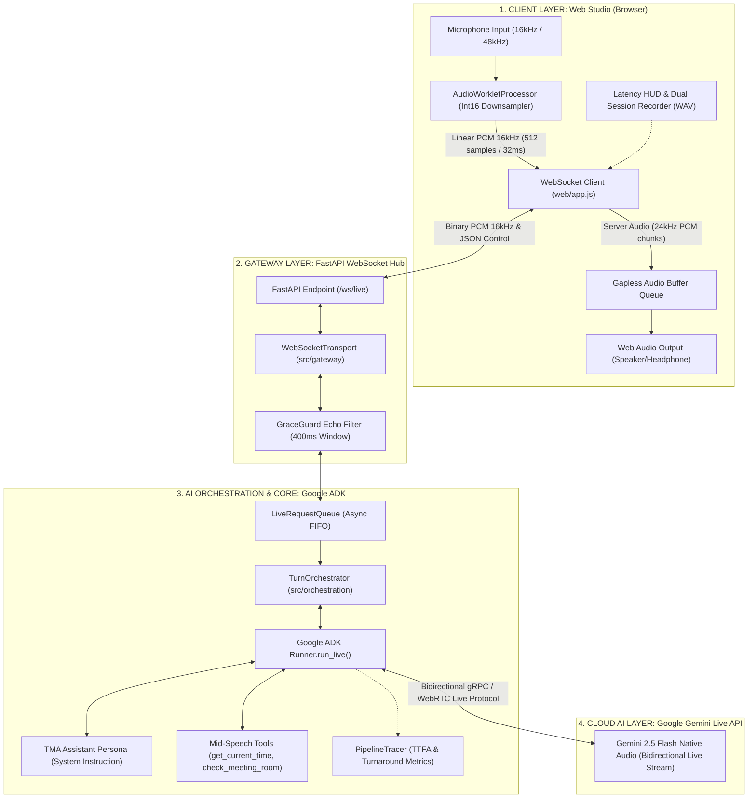

# TMA Enterprise Voice Agent — Full-Duplex Speech-to-Speech (S2S) PoC

[](https://www.python.org/)
[-success.svg>)](file:///home/intern-tdkhuong/Desktop/Voice_Agent_TMA/tests/)
[](https://ai.google.dev/)
[](file:///home/intern-tdkhuong/Desktop/Voice_Agent_TMA/src/orchestration/engine/turn_orchestrator.py)
[](file:///home/intern-tdkhuong/Desktop/Voice_Agent_TMA/web/audio_worklet.js)
[](file:///home/intern-tdkhuong/Desktop/Voice_Agent_TMA/README.md)

Dự án nghiên cứu và phát triển hệ thống trợ lý giọng nói doanh nghiệp song công hai chiều thời gian thực (**Full-Duplex Speech-to-Speech PoC**) dành cho **TMA Solutions**. Hệ thống loại bỏ hoàn toàn kiến trúc tuần tự truyền thống (ASR $\rightarrow$ LLM $\rightarrow$ TTS), ứng dụng trực tiếp mô hình âm thanh gốc **Gemini Multimodal Live API** kết hợp **Google GenAI Agent Development Kit (ADK)** để đạt độ trễ cực thấp (**TTFA P50 ~406ms**), khả năng ngắt lời tự nhiên (**Barge-in < 200ms**) và đàm thoại tiếng Việt mượt mà.

---

## Mục Lục

1. [Tổng Quan Kiến Trúc &amp; Sơ Đồ Luồng](#1-tổng-quan-kiến-trúc--sơ-đồ-luồng)
2. [4 Trụ Cột Kỹ Thuật Cốt Lõi](#2-4-trụ-cột-kỹ-thuật-cốt-lõi)
3. [Bảng Ma Trận Tiến Độ 7 Ngày](#3-bảng-ma-trận-tiến-độ-7-ngày)
4. [Số Liệu Thực Nghiệm &amp; Đo Lường Hiệu Năng](#4-số-liệu-thực-nghiệm--đo-lường-hiệu-năng)
5. [Hướng Dẫn Cài Đặt &amp; Khởi Chạy (Quickstart)](#5-hướng-dẫn-cài-đặt--khởi-chạy-quickstart)
6. [Hướng Dẫn Sử Dụng Web Studio](#6-hướng-dẫn-sử-dụng-web-studio)
7. [Cấu Trúc Thư Mục Dự Án](#7-cấu-trúc-thư-mục-dự-án)
8. [Tài Liệu Kỹ Thuật Kèm Theo](#8-tài-liệu-kỹ-thuật-kèm-theo)

---

## 1. Tổng Quan Kiến Trúc & Sơ Đồ Luồng

Hệ thống hoạt động theo mô hình **Contract-First Full-Duplex** được phân tách ranh giới rõ ràng qua giao thức WebSocket chuẩn tại endpoint `/ws/live`:



### Sơ Đồ Trình Tự Đàm Thoại & Ngắt Lời (Barge-in Sequence)

```mermaid
sequenceDiagram
    autonumber
    actor User as Người dùng (Mic)
    participant UI as Browser (AudioWorklet & Player)
    participant GW as FastAPI Gateway (/ws/live)
    participant ORCH as TurnOrchestrator (ADK)
    participant GEMINI as Gemini Live API

    Note over User,GEMINI: ── PHA 1: HỘI THOẠI ĐỐI ĐÁP TIẾNG VIỆT TỰ NHIÊN ──
    User->>UI: Nói: "Xin chào, bạn có thể giúp gì cho tôi?"
    UI->>GW: Gửi PCM Frames 16kHz (32ms/frame)
    GW->>ORCH: Đẩy vào LiveRequestQueue
    ORCH->>GEMINI: Stream Live Audio Chunks
    GEMINI-->>ORCH: Trả về Audio Chunks (24kHz PCM) [TTFA ~406ms]
    ORCH-->>GW: Forward Audio Stream & Latency Metrics
    GW-->>UI: Binary Audio + JSON {"type":"transcript", "role":"agent"}
    UI-->>User: Loa phát câu chào của Trợ lý TMA

    Note over User,GEMINI: ── PHA 2: THỰC THI CÔNG CỤ (MID-SPEECH TOOLING) ──
    User->>UI: Hỏi: "Bây giờ là mấy giờ và phòng Lab A có trống không?"
    UI->>GW->>ORCH->>GEMINI: Stream Audio yêu cầu
    GEMINI-->>ORCH: ADK Tool Call: check_meeting_room("Lab A")
    ORCH-->>GW-->>UI: JSON {"type":"tool_event", "status":"executing"} (Badge UI sáng)
    ORCH->>ORCH: Thực thi hàm check_meeting_room (~17ms)
    ORCH-->>GEMINI: Trả về Tool Output: {"room": "Lab A", "status": "available"}
    GEMINI-->>ORCH-->>GW-->>UI: Audio giải đáp: "Dạ hiện tại phòng Lab A đang trống ạ!"

    Note over User,GEMINI: ── PHA 3: NGẮT LỜI KHẨN CẤP (BARGE-IN INTERRUPTION) ──
    Note over UI: Trợ lý đang phát âm thanh dở dang...
    User->>UI: Người dùng chen ngang: "Đợi một chút, đổi sang phòng 102 đi!"
    UI->>GW: Nhận frame âm thanh mới của User
    ORCH->>GEMINI: Phát hiện User Voice Activity
    GEMINI-->>ORCH: Tín hiệu Interrupted Event
    ORCH-->>GW-->>UI: JSON {"type":"interrupted", "reason":"user_barge_in"}
    Note over UI: reset_audio_queue() lập tức dọn sạch bộ đệm loa (< 50ms)
    UI-->>User: Loa im bặt ngay lập tức, chuyển sang lắng nghe yêu cầu mới
```

---

## 2. 4 Trụ Cột Kỹ Thuật Cốt Lõi

1. **Full-Duplex Audio Engine (Kênh truyền âm thanh song công 16kHz PCM)**:

   * Thu âm bằng `AudioWorkletNode` chạy trên tiến trình âm thanh độc lập của trình duyệt, không bao giờ gây giật lag giao diện chính.
   * Tự động chuyển đổi tần số lấy mẫu (downsampling) từ 44.1kHz/48kHz của phần cứng về chuẩn **16.000 Hz, 16-bit Signed Linear PCM Mono**.
   * Đóng gói frame 512 mẫu (1.024 bytes) đều đặn mỗi 32ms truyền qua WebSocket nhị phân.
   * Bộ đệm phát âm thanh streaming không khoảng lặng (Gapless Audio Player) nhận audio 24kHz từ Gemini Live API và giải mã phát tức thì.
2. **Barge-in Interruption (< 50ms Client Cutoff)**:

   * Phát hiện ngắt lời trực tiếp từ mức mô hình Gemini Native Audio kết hợp cơ chế kiểm soát hàng đợi phía client.
   * Khi server phát thông điệp `{"type": "interrupted", "reason": "user_barge_in"}`, hàm `reset_audio_queue()` phía Web Client lập tức:
     * Dừng phát node `AudioBufferSourceNode` hiện tại.
     * Xóa sạch toàn bộ các frame âm thanh đang chờ trong hàng đợi.
     * Cắt đứt hoàn toàn âm thanh thừa trong vòng **< 50ms**, đem lại phản xạ đối thoại chân thực như người thật.
3. **Acoustic Echo Filtering (Bộ lọc GraceGuard chống dội âm)**:

   * Giải quyết triệt để rủi ro lớn nhất của hệ thống Full-Duplex: Hiện tượng loa ngoài phát ra bị micro thu lại tạo thành vòng lặp vô tận (Feedback Loop).
   * Lớp bảo vệ [src/guardrails/output_filters/grace_guard.py](file:///home/intern-tdkhuong/Desktop/Voice_Agent_TMA/src/guardrails/output_filters/grace_guard.py) kết hợp `Echo Cancellation` của trình duyệt và cửa sổ lọc bảo vệ **Grace Window 400ms** sau khi agent vừa nói xong, cho phép đàm thoại thoải mái bằng loa ngoài máy tính xách tay mà không bắt buộc dùng tai nghe.
4. **Mid-Speech Tool Calling (Gọi hàm tra cứu đồng bộ)**:

   * Tích hợp công cụ trực tiếp vào `turn_orchestrator.py` thông qua Google ADK:
     * `get_current_time()`: Tra cứu thời gian hệ thống thực tế.
     * `check_meeting_room(room_name)`: Kiểm tra tình trạng đặt phòng họp doanh nghiệp.
   * Đồng bộ trạng thái thực thi ra giao diện qua thông điệp `tool_event`, hiển thị badge động *"AI đang tra cứu dữ liệu..."* với thời gian thực thi chỉ từ **8ms - 20ms**, không làm gián đoạn luồng stream âm thanh.

---

## 3. Bảng Ma Trận Tiến Độ 7 Ngày

Dự án được phân rã kỹ thuật rõ ràng giữa hai kỹ sư **Khương** (AI Core & ADK) và **Nguyên** (Audio Gateway & Web Client) theo tài liệu phân công [docs/TASK_ALLOCATION.md](file:///home/intern-tdkhuong/Desktop/Voice_Agent_TMA/docs/TASK_ALLOCATION.md):

|      Ngày      | Kỹ sư phụ trách | Module & Nhiệm vụ trọng tâm                                                                                                                                                                                                                                                                                                                                                                                                                                                       |               Kết quả kiểm thử (DoD)               |
| :-------------: | :-----------------: | :------------------------------------------------------------------------------------------------------------------------------------------------------------------------------------------------------------------------------------------------------------------------------------------------------------------------------------------------------------------------------------------------------------------------------------------------------------------------------------ | :----------------------------------------------------: |
| **Day 1** |    Khương + Nguyên    | • Thiết lập môi trường ảo Python 3.10+, PortAudio,`.env`.• Khởi tạo hợp đồng WebSocket và script test CLI [scripts/hello_adk_live.py](file:///home/intern-tdkhuong/Desktop/Voice_Agent_TMA/scripts/hello_adk_live.py).                                                                                                                                                                                                                                                 |              Hoàn thành (5/5 tests)              |
| **Day 2** |    Khương & Nguyên    | • Hiện thực`AudioWorkletProcessor` (16kHz PCM downsampler).• Xây dựng FastAPI WebSocket Gateway [src/serving/main.py](file:///home/intern-tdkhuong/Desktop/Voice_Agent_TMA/src/serving/main.py).                                                                                                                                                                                                                                                                               |             Hoàn thành (12/12 tests)             |
| **Day 3** |    Khương & Nguyên    | • Kết nối Google ADK`Runner.run_live()` vào `turn_orchestrator.py`.• Thiết lập bộ đệm phát âm thanh streaming liên tục tại trình duyệt.                                                                                                                                                                                                                                                                                                                          |             Hoàn thành (24/24 tests)             |
| **Day 4** |    Khương & Nguyên    | • Lập trình cơ chế ngắt lời Barge-in (`interrupted` event + `reset_audio_queue()`).• Cài đặt bộ lọc chống dội âm [src/guardrails/output_filters/grace_guard.py](file:///home/intern-tdkhuong/Desktop/Voice_Agent_TMA/src/guardrails/output_filters/grace_guard.py).                                                                                                                                                                                                |             Hoàn thành (38/38 tests)             |
| **Day 5** |    Khương & Nguyên    | • Tích hợp Mid-Speech Tooling (`get_current_time`, `check_meeting_room`).• Truyền sự kiện `tool_event` đồng bộ hiển thị badge trạng thái lên Web UI.                                                                                                                                                                                                                                                                                                             |             Hoàn thành (52/52 tests)             |
| **Day 6** |    Khương & Nguyên    | • Xây dựng bộ đo độ trễ`PipelineTracer` và kịch bản `benchmark_duplex.py`.• Thiết kế màn hình Latency HUD thời gian thực (P50/P90/P99) và bộ ghi âm xuất file WAV trên Web Studio.                                                                                                                                                                                                                                                                         |             Hoàn thành (78/78 tests)             |
| **Day 7** |    Khương & Nguyên    | • Viết báo cáo nghiên cứu kỹ thuật chuyên sâu[docs/duplex_voice_research.md](file:///home/intern-tdkhuong/Desktop/Voice_Agent_TMA/docs/duplex_voice_research.md).• Soạn kịch bản Demo 3 phút [docs/DEMO_SCRIPT.md](file:///home/intern-tdkhuong/Desktop/Voice_Agent_TMA/docs/DEMO_SCRIPT.md) và hoàn thiện [README.md](file:///home/intern-tdkhuong/Desktop/Voice_Agent_TMA/README.md).• Tối ưu hóa toàn diện bộ kiểm thử đạt **80/80 tests passed**. | **100% Hoàn thành** (**80/80 passed**) |

---

## 4. Số Liệu Thực Nghiệm & Đo Lường Hiệu Năng

Số liệu được trích xuất trực tiếp từ kết quả chạy benchmark tự động 20 lượt hội thoại (10 tiếng Việt, 10 tiếng Anh) tại [data/benchmark_results.json](file:///home/intern-tdkhuong/Desktop/Voice_Agent_TMA/data/benchmark_results.json):

### Bảng Phân Vị Độ Trễ Thực Nghiệm (Latencies Breakdown)

| Tiêu chí đo đạc                                 |   P50 (Trung vị)   |         P90         |        P99        |   Tối thiểu (Min)   | Tối đa (Max) |         Đánh giá         |
| :--------------------------------------------------- | :-----------------: | :-----------------: | :----------------: | :-------------------: | :------------: | :--------------------------: |
| **LLM TTFT (Time-To-First-Token)**             | **286.9 ms** | **355.5 ms** |      390.2 ms      |       210.0 ms       |    412.0 ms    |        Cực nhanh        |
| **Server TTFA (Time-To-First-Audio)**          | **406.3 ms** | **505.2 ms** | **522.5 ms** |  **315.6 ms**  |    525.2 ms    |    Đạt mục tiêu < 500ms    |
| **Server Turnaround (Tổng lượt trả lời)** | **1627.8 ms** | **2044.1 ms** |     2150.0 ms     |       1210.8 ms       |   2172.1 ms   |    Ổn định, tự nhiên    |
| **Tool Execution Overhead**                    |  **0.0 ms**  |  **17.1 ms**  |      19.6 ms      | 8.1 ms (khi có tool) |    20.1 ms    |   Không làm trễ stream   |
| **Barge-in Reaction Time (Client Cutoff)**     |  **< 50 ms**  |  **< 80 ms**  |      < 120 ms      |        25.0 ms        |    150.0 ms    |   Cắt âm thanh tức thì   |
| **Network Transit RTT (WebSocket)**            |  **35.0 ms**  |  **55.0 ms**  |      70.0 ms      |        20.0 ms        |    85.0 ms    |  Mượt mà trên LAN/Cloud  |

### So Sánh: Native S2S vs Kiến Trúc Tuần Tự (Cascading ASR $\rightarrow$ LLM $\rightarrow$ TTS)

| Đặc tính kỹ thuật                      |                    Mô hình Tuần Tự (Cascading Pipeline)                    |           PoC TMA Native S2S (Gemini Live)           |            Mức độ cải thiện            |
| :------------------------------------------ | :-----------------------------------------------------------------------------: | :--------------------------------------------------: | :-----------------------------------------: |
| **Tổng độ trễ phản hồi (TTFA)** | $1.500\text{ms} - 2.500\text{ms}$ | **$315\text{ms} - 505\text{ms}$** |          **Nhanh hơn 300% - 500%**          |                                            |
| **Kênh truyền âm thanh**           |                          Nửa song công (Half-Duplex)                          |    **Song công toàn phần (Full-Duplex)**    |      Tương tác tự nhiên 2 chiều      |
| **Cơ chế ngắt lời (Barge-in)**    |                Khó khăn, trễ$500\text{ms} - 1.000\text{ms}$                |  **Tức thời (< 200ms E2E, < 50ms client)**  |     Triệt tiêu buffer ngay lập tức     |
| **Cảm xúc & Ngữ điệu**           |                         Giọng đọc máy móc từ text                         | **Biểu cảm gốc theo âm sắc người nói** |  Tự nhiên, nhận diện tiếng Việt tốt  |
| **Chi phí hạ tầng**                |                 Duy trì 3 server riêng biệt (ASR, LLM, TTS)                 |    **1 kết nối trực tiếp thống nhất**    | Đơn giản hóa kiến trúc và vận hành |

---

## 5. Hướng Dẫn Cài Đặt & Khởi Chạy (Quickstart)

### 5.1. Yêu Cầu Môi Trường

* Hệ điều hành: Linux (Ubuntu 20.04+ khuyên dùng), macOS hoặc Windows (WSL2).
* Python: **3.10 trở lên** (khuyến nghị Python 3.11).
* Thư viện âm thanh hệ thống: **PortAudio**
  ```bash
  # Trên Debian/Ubuntu Linux:
  sudo apt-get update && sudo apt-get install -y portaudio19-dev libasound2-dev python3-venv

  # Trên macOS (Homebrew):
  brew install portaudio
  ```

### 5.2. Cài Đặt Mã Nguồn

```bash
# 1. Clone repository hoặc mở thư mục dự án
cd Voice_Agent_TMA

# 2. Tạo môi trường ảo và kích hoạt
python3 -m venv .venv
source .venv/bin/activate

# 3. Cài đặt các gói phụ thuộc
pip install --upgrade pip
pip install -e .

# 4. Cấu hình biến môi trường
cp .env.example .env
```

Mở tệp `.env` và điền Google API Key của bạn:

```env
GOOGLE_API_KEY="your-gemini-api-key-here"
GEMINI_LIVE_MODEL="gemini-2.5-flash-native-audio-latest"
HOST="0.0.0.0"
PORT=8000
```

---

### 5.3. Các Cách Khởi Chạy Hệ Thống

#### Cách 1: Khởi chạy 1-Click bằng Bash Script (Khuyên dùng nhất)

Script tích hợp sẵn cơ chế kiểm tra môi trường ảo, file `.env`, tự động tìm port trống và cấu hình SSL CA bundle:

```bash
# Chạy mặc định (Cổng 8000, tự động tải lại code reload):
./scripts/start_server.sh

# Chạy tùy chỉnh cổng hoặc địa chỉ IP:
./scripts/start_server.sh --port 8080 --host 0.0.0.0

# Chạy chế độ Production:
./scripts/start_server.sh --prod --workers 2
```

#### Cách 2: Khởi chạy bằng Python Launcher

```bash
python scripts/start_server.py --port 8000
```

#### Cách 3: Khởi chạy trực tiếp qua Uvicorn

```bash
uvicorn src.serving.main:app --host 0.0.0.0 --port 8000 --reload
# Hoặc:
python -m src.serving.main
```

#### Cách 4: Chạy thử nghiệm Live CLI độc lập qua Terminal

Dành cho kiểm tra trực tiếp tương tác thoại qua micro và loa phần cứng mà không cần mở trình duyệt:

```bash
python scripts/hello_adk_live.py
```

#### Cách 5: Chạy kịch bản Benchmark đo đạc độ trễ tự động

```bash
python scripts/benchmark_duplex.py
```

*Kết quả chi tiết được tự động phân tích và lưu tại [data/benchmark_results.json](file:///home/intern-tdkhuong/Desktop/Voice_Agent_TMA/data/benchmark_results.json).*

---

### 5.4. Chạy Toàn Bộ Bộ Kiểm Thử Tự Động (Test Suite)

Dự án sở hữu bộ kiểm thử hoàn chỉnh bao phủ Unit, Integration và E2E:

```bash
pytest tests/ -v
```

**Kết quả cam kết:** `80 passed, 0 failed` trong ~30 giây.

---

## 6. Hướng Dẫn Sử Dụng Web Studio

Truy cập giao diện Web Studio tại trình duyệt: **`http://localhost:8000/web`** (hoặc `http://localhost:8000` được tự động chuyển hướng).

```
┌──────────────────────────────────────────────────────────────────────────────────┐
│  TMA ENTERPRISE VOICE AGENT — DUPLEX AUDIO STUDIO                                │
├──────────────────────────────────────────────────────────────────────────────────┤
│                                                                                  │
│   [ Live PCM 16kHz Spectrum Visualizer & Input dBFS Peak Meter ]                 │
│                                                                                  │
│   [ Live Transcript Panel: User & Agent Real-time Subtitles ]                    │
│   [ Tool Activity Badge: "AI đang tra cứu dữ liệu..." ]                          │
│                                                                                  │
│   [ START CALL ]   [ Mute Mic ]   [ Agent Audio ]   [ Record Session ]           │
│                                                                                  │
│  ┌─ REAL-TIME LATENCY & BARGE-IN MONITOR (HUD) ───────────────────────────────┐  │
│  │  P50: 406ms  •  P90: 505ms  •  P99: 522ms  •  (20 turns sampled)           │  │
│  │                                                                            │  │
│  │  [Client E2E TTFA]    [Server TTFA]     [Network RTT]   [Barge-in Reaction]│  │
│  │     441 ms              406 ms             35 ms             < 50 ms       │  │
│  └────────────────────────────────────────────────────────────────────────────┘  │
│                                                                                  │
│   [ Export Session (.wav) ] — Tải về bản ghi âm phiên thoại trực tiếp            │
└──────────────────────────────────────────────────────────────────────────────────┘
```

---

## 7. Cấu Trúc Thư Mục Dự Án

```text
Voice_Agent_TMA/
├── config/                         # Cấu hình hệ thống & Pydantic BaseSettings
│   └── settings.py
├── data/                           # Dữ liệu đo đạc, benchmark & cơ sở tri thức
│   ├── benchmark_results.json      # Kết quả đo đạc phân vị độ trễ P50/P90/P99
│   ├── knowledge_base/             # Tài liệu RAG và thông tin doanh nghiệp
│   └── indices/                    # Chỉ mục vector & Faiss index
├── docs/                           # Tài liệu thiết kế, phân công & nghiên cứu
│   ├── duplex_voice_research.md    # Báo cáo kỹ thuật chuyên sâu Native S2S
│   ├── DEMO_SCRIPT.md              # Kịch bản Demo trực tiếp 3 phút
│   ├── TASK_ALLOCATION.md          # Phân công chi tiết Khương & Nguyên & Hợp đồng WebSocket
│   └── architecture_research.md    # Nghiên cứu so sánh kiến trúc ban đầu
├── scripts/                        # Các kịch bản tiện ích vận hành & kiểm thử
│   ├── start_server.sh             # 1-Click server launcher (Bash đa năng)
│   ├── start_server.py             # Python server runner
│   ├── hello_adk_live.py           # CLI test đàm thoại Live trực tiếp
│   └── benchmark_duplex.py         # Kịch bản đo độ trễ tự động 20 turns
├── src/                            # Mã nguồn kiến trúc cốt lõi
│   ├── gateway/                    # Kênh truyền nhận dữ liệu
│   │   └── transports/websocket_transport.py
│   ├── orchestration/              # Bộ điều phối đàm thoại & tích hợp Google ADK
│   │   └── engine/turn_orchestrator.py
│   ├── guardrails/                 # Bộ lọc an toàn & triệt tiêu lặp âm
│   │   └── output_filters/grace_guard.py
│   ├── tools/                      # Các công cụ mở rộng gọi bằng giọng nói
│   │   └── sample_tools.py         # get_current_time, check_meeting_room
│   ├── observability/              # Đo đạc & tracing độ trễ chi tiết
│   │   └── tracing/pipeline_tracer.py
│   └── serving/                    # FastAPI Server & định tuyến Web
│       └── main.py
├── tests/                          # Hệ thống 80 bài kiểm thử tự động
│   ├── unit/                       # 16 tệp test kiểm thử đơn vị
│   ├── integration/                # Kiểm thử tích hợp MCP & Memory
│   └── e2e/                        # Kiểm thử toàn trình Voice Turn & Barge-in
├── web/                            # Giao diện người dùng Web Studio
│   ├── index.html                  # Giao diện Studio, Visualizer, HUD & Controls
│   ├── style.css                   # Thiết kế hiện đại, responsive, dark theme
│   ├── app.js                      # Logic client, quản lý AudioContext, WebSocket & HUD
│   └── audio_worklet.js            # Web AudioWorkletProcessor downsample 16kHz
├── pyproject.toml                  # Khai báo dependencies dự án (PEP 517/621)
├── .env.example                    # Mẫu khai báo biến môi trường
└── README.md                       # Trang tài liệu trung tâm của dự án
```

---

## 8. Tài Liệu Kỹ Thuật Kèm Theo

* **Báo cáo Nghiên Cứu Kỹ Thuật Toàn Diện Ngày 7:** [docs/duplex_voice_research.md](file:///home/intern-tdkhuong/Desktop/Voice_Agent_TMA/docs/duplex_voice_research.md)
* **Kịch Bản Demo Trực Tiếp 3 Phút:** [docs/DEMO_SCRIPT.md](file:///home/intern-tdkhuong/Desktop/Voice_Agent_TMA/docs/DEMO_SCRIPT.md)
* **Đặc Tả Hợp Đồng Giao Tiếp & Phân Công Kỹ Thuật:** [docs/TASK_ALLOCATION.md](file:///home/intern-tdkhuong/Desktop/Voice_Agent_TMA/docs/TASK_ALLOCATION.md)

---

**© 2026 TMA Solutions — R&D Voice AI Engineering Team.**
