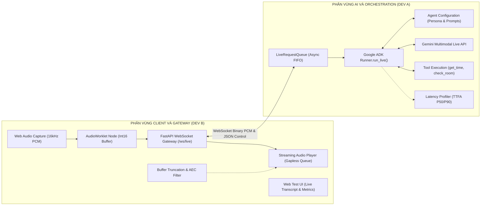
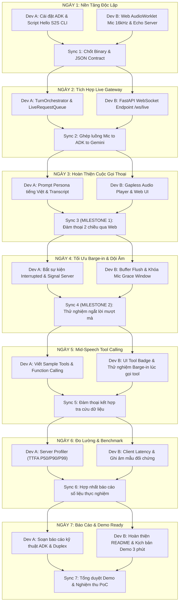
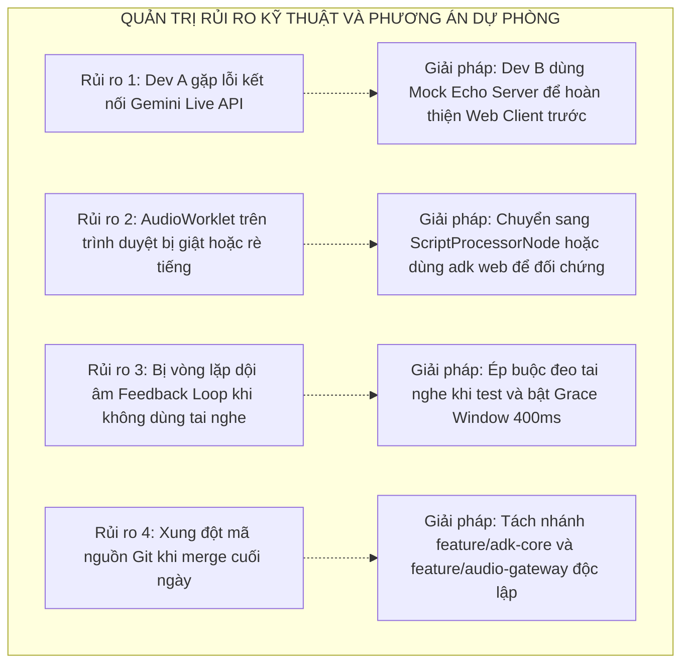

# Kế Hoạch Phân Công Nhiệm Vụ 2 Lập Trình Viên (Chi Tiết Kỹ Thuật)
## Dự Án: PoC Voice Agent Speech-to-Speech & Nghiên Cứu Duplex Voice (1 Tuần)

> **Thời gian thực hiện:** 7 Ngày làm việc  
> **Quy mô đội ngũ:** 2 Kỹ sư phần mềm (**Dev A** và **Dev B**)  
> **Mục tiêu:** Tối ưu hóa hiệu suất làm việc song song, xác định rõ hợp đồng giao tiếp (Contract-First), phân chia chi tiết từng buổi làm việc và checklist kiểm thử cho từng đầu việc.

---

## 1. Kiến Trúc Phân Vai & Sơ Đồ Tích Hợp

Dự án được phân rã thành hai phân vùng độc lập dựa trên ranh giới mạng WebSocket tại [src/serving/main.py](file:///home/intern-nvnguyen1/Project/Voice_Agent_TMA/src/serving/main.py):



---

## 2. Đặc Tả Chi Tiết Hợp Đồng Giao Tiếp WebSocket (Contract Specification)

Để hai lập trình viên có thể phát triển độc lập mà không cần chờ đợi nhau, giao thức WebSocket `/ws/live` được chuẩn hóa chi tiết như sau:

### 2.1. Luồng Âm Thanh Nhị Phân (Binary Streams)
* **Client gửi lên Server (Mic Input):**
  - Định dạng: Linear PCM, 16-bit Signed Integer (`int16`), Little-Endian, 1 kênh (Mono).
  - Tần số lấy mẫu: **16.000 Hz**.
  - Kích thước mỗi frame: **512 mẫu âm thanh = 1.024 bytes** (tương đương 32ms thời gian thực).
  - Tần suất truyền: ~31,25 gói/giây.
* **Server gửi về Client (Model Audio Output):**
  - Định dạng: Linear PCM, 16-bit Signed Integer (`int16`), Little-Endian, Mono.
  - Tần số: **24.000 Hz** (chuẩn phát ra từ Gemini Live) hoặc **16.000 Hz**.
  - Client nhận dưới dạng `ArrayBuffer` hoặc `Blob` và đẩy trực tiếp vào bộ đệm phát âm thanh.

### 2.2. Luồng Điều Khiển Văn Bản (JSON Control Messages)

#### A. Server $\rightarrow$ Client (Thông điệp từ Dev A sang Dev B)
1. **Lệnh ngắt lời khẩn cấp (`interrupted`):**
   ```json
   {
     "type": "interrupted",
     "timestamp_ms": 1727600123456,
     "reason": "user_barge_in"
   }
   ```
   *Yêu cầu Dev B:* Lập tức dừng phát `AudioBufferSourceNode` hiện tại và xóa sạch toàn bộ hàng đợi âm thanh chưa phát.

2. **Dữ liệu phụ đề trực tiếp (`transcript`):**
   ```json
   {
     "type": "transcript",
     "role": "user",
     "text": "Kiểm tra phòng họp giúp tôi",
     "is_final": true
   }
   ```
   ```json
   {
     "type": "transcript",
     "role": "agent",
     "text": "Dạ, phòng họp A hiện đang trống ạ.",
     "is_final": false
   }
   ```

3. **Trạng thái thực thi công cụ (`tool_event`):**
   ```json
   {
     "type": "tool_event",
     "tool_name": "check_meeting_room",
     "status": "executing",
     "params": {"room_name": "Phòng A"}
   }
   ```

4. **Chỉ số đo độ trễ (`latency_metric`):**
   ```json
   {
     "type": "latency_metric",
     "ttfa_ms": 412,
     "server_turnaround_ms": 320,
     "timestamp_ms": 1727600125000
   }
   ```

#### B. Client $\rightarrow$ Server (Thông điệp từ Dev B sang Dev A)
1. **Khởi tạo và cấu hình phiên (`session_start`):**
   ```json
   {
     "type": "session_start",
     "sample_rate": 16000,
     "client_timestamp": 1727600120000,
     "language": "vi-VN"
   }
   ```

2. **Kết thúc cuộc gọi (`session_stop`):**
   ```json
   {
     "type": "session_stop",
     "reason": "user_hangup"
   }
   ```

---

## 3. Lộ Trình Phân Công 7 Ngày Chi Tiết Cho Từng Buổi



---

### NGÀY 1: Thiết Lập Nền Tảng & Môi Trường Độc Lập

#### Dev A: AI & ADK Core Lead
* **Buổi sáng (08:30 - 12:00):**
  - Cập nhật [pyproject.toml](file:///home/intern-nvnguyen1/Project/Voice_Agent_TMA/pyproject.toml): thêm `google-adk>=0.1.0`, `google-genai>=0.1.0`, `websockets>=12.0`, `sounddevice>=0.4.6`, `numpy>=1.24.0`.
  - Thiết lập môi trường ảo và cài đặt gói: `pip install -e .`.
  - Cấu hình [config/settings.py](file:///home/intern-nvnguyen1/Project/Voice_Agent_TMA/config/settings.py) đọc `GOOGLE_API_KEY`, `GEMINI_LIVE_MODEL="gemini-2.0-flash-exp"`.
* **Buổi chiều (13:30 - 17:30):**
  - Viết script nguyên mẫu `scripts/hello_adk_live.py`:
    - Khởi tạo `Agent` với Google ADK:
      ```python
      from google.adk.agent import Agent
      from google.adk.runner import Runner
      agent = Agent(name="voice_poc", model="gemini-2.0-flash-exp", instruction="Trả lời ngắn gọn dưới 2 câu.")
      ```
    - Chạy kết nối đàm thoại âm thanh hai chiều trực tiếp bằng mic máy cục bộ qua `sounddevice`.
* **Tiêu chí nghiệm thu (DoD Dev A):** Chạy lệnh `python scripts/hello_adk_live.py`, nói vào mic và nghe loa phát âm thanh phản hồi từ Gemini Live.

#### Dev B: Audio Gateway & Web Client Lead
* **Buổi sáng (08:30 - 12:00):**
  - Khởi tạo cấu trúc thư mục giao diện `web/` (`web/index.html`, `web/app.js`, `web/audio_worklet.js`, `web/style.css`).
  - Viết `web/audio_worklet.js`:
    - Tạo `AudioWorkletProcessor` nhận các khung `Float32Array` từ micro.
    - Chuyển đổi sang `Int16Array` (Linear PCM 16kHz mono).
    - Gom buffer đủ 512 mẫu (1.024 bytes) rồi postMessage về thread chính.
* **Buổi chiều (13:30 - 17:30):**
  - Viết `web/app.js` khởi tạo WebSocket kết nối thử nghiệm.
  - Viết một mock WebSocket server nhỏ bằng FastAPI (`tests/mock_echo_ws.py`): Nhận binary bytes từ trình duyệt và in kích thước ra console để xác minh sample rate.
* **Tiêu chí nghiệm thu (DoD Dev B):** Mở trình duyệt, bật mic, mock server ghi nhận liên tục các gói nhị phân đúng 1.024 bytes mỗi 32ms.

#### Buổi Sync Cuối Ngày 1 (17:30 - 18:00)
- Hai Dev đối chiếu gói tin WebSocket, kiểm tra độ tương thích kiểu dữ liệu `Int16Array` $\leftrightarrow$ `bytes`.
- Ký duyệt hợp đồng giao tiếp tại Mục 2.

---

### NGÀY 2: Hiện Thực Hóa Gateway & Tích Hợp LiveRequestQueue

#### Dev A: AI & ADK Core Lead
* **Buổi sáng (08:30 - 12:00):**
  - Hiện thực hóa [src/orchestration/engine/turn_orchestrator.py](file:///home/intern-nvnguyen1/Project/Voice_Agent_TMA/src/orchestration/engine/turn_orchestrator.py):
    - Khởi tạo class `ADKLiveOrchestrator`.
    - Tạo hàng đợi bất đồng bộ `LiveRequestQueue` để tiếp nhận các chunk âm thanh.
    - Cấu hình `RunConfig(streaming_mode="BIDI", response_modalities=["AUDIO"])`.
* **Buổi chiều (13:30 - 17:30):**
  - Viết hàm điều phối chính `start_live_session(audio_in_queue, event_out_callback)`:
    - Task 1: Đọc từ `audio_in_queue` và chuyển tiếp vào `LiveRequestQueue`.
    - Task 2: Lắng nghe dòng sự kiện từ `runner.run_live()`:
      - Khi nhận audio chunk: gọi `event_out_callback("audio", chunk_bytes)`.
      - Khi nhận transcript: gọi `event_out_callback("transcript", text_data)`.
* **Tiêu chí nghiệm thu (DoD Dev A):** Chạy unit test giả lập đẩy 10 audio chunks vào queue, orchestrator kích hoạt `run_live()` không báo lỗi.

#### Dev B: Audio Gateway & Web Client Lead
* **Buổi sáng (08:30 - 12:00):**
  - Hiện thực hóa [src/gateway/transports/websocket_transport.py](file:///home/intern-nvnguyen1/Project/Voice_Agent_TMA/src/gateway/transports/websocket_transport.py):
    - Xử lý vòng lặp tiếp nhận WebSocket `websocket.receive()` phân biệt `bytes` và `text`.
    - Đưa binary bytes vào `asyncio.Queue` chia sẻ.
* **Buổi chiều (13:30 - 17:30):**
  - Cập nhật [src/serving/main.py](file:///home/intern-nvnguyen1/Project/Voice_Agent_TMA/src/serving/main.py):
    - Định nghĩa endpoint WebSocket: `@app.websocket("/ws/live")`.
    - Mount thư mục tĩnh: `app.mount("/web", StaticFiles(directory="web", html=True))`.
    - Xử lý logic kết nối và ngắt kết nối WebSocket an toàn (try/except `WebSocketDisconnect`).
* **Tiêu chí nghiệm thu (DoD Dev B):** Trình duyệt kết nối được tới `ws://localhost:8000/ws/live` và gửi/nhận thông điệp handshake thành công.

#### Buổi Sync Cuối Ngày 2 (17:30 - 18:00)
- **Tích hợp Cột mốc 1:** Nối `websocket_transport.py` của Dev B vào `turn_orchestrator.py` của Dev A.
- **Kịch bản kiểm thử:** Nói một từ vào trình duyệt $\rightarrow$ Log server hiển thị Gemini nhận được gói âm thanh và sinh phản hồi.

---

### NGÀY 3: Bộ Phát Âm Thanh Nối Tiếp & Giao Diện Web Hoàn Chỉnh

#### Dev A: AI & ADK Core Lead
* **Buổi sáng (08:30 - 12:00):**
  - Tinh chỉnh Prompt chỉ định phong cách hội thoại (Persona):
    - Đặt tính cách: Trợ lý giọng nói tiếng Việt ngắn gọn, súc tích, ngữ điệu thân thiện.
    - Chỉ thị đặc biệt: Không trả lời dài quá 2 câu; không dùng bảng biểu, markdown hay code block.
* **Buổi chiều (13:30 - 17:30):**
  - Bóc tách sự kiện `transcript` từ Gemini Live:
    - Bóc tách văn bản người dùng (User input transcript) và văn bản mô hình (Model output transcript).
    - Chuẩn hóa thành thông điệp JSON `{"type": "transcript", ...}` gửi về gateway.
  - Cấu hình thử nghiệm các giọng đọc khác nhau của Google: `Puck`, `Charon`, `Kore`.
* **Tiêu chí nghiệm thu (DoD Dev A):** Transcript thời gian thực được đẩy ra callback đầy đủ khi có tiếng người nói.

#### Dev B: Audio Gateway & Web Client Lead
* **Buổi sáng (08:30 - 12:00):**
  - Xây dựng **Streaming Audio Player** trong `web/app.js`:
    - Tạo `AudioContext` và danh sách hàng đợi các mảng âm thanh `audioQueue = []`.
    - Xử lý ghép nối các chunk âm thanh (PCM 24kHz/16kHz) nối tiếp mượt mà (Scheduled Audio Playback).
    - Triệt tiêu hiện tượng ngắt quãng (Underflow) và trễ dồn tích (Drift).
* **Buổi chiều (13:30 - 17:30):**
  - Hoàn thiện giao diện người dùng `web/index.html`:
    - Nút bấm to "BẮT ĐẦU CUỘC GỌI" / "KẾT THÚC".
    - Thanh hiển thị sóng âm (Canvas Waveform Visualizer).
    - Khung chat phụ đề trực tiếp (Live Subtitles Box) hiển thị lời của User (màu xanh) và Agent (màu trắng).
* **Tiêu chí nghiệm thu (DoD Dev B):** Khi server bắn về mảng audio bytes liên tục, trình duyệt phát ra âm thanh rõ ràng, không bị giật, rè hay méo tiếng.

#### Buổi Sync Cuối Ngày 3 (17:30 - 18:00)
- **CỘT MỐC QUAN TRỌNG (MILESTONE 1):** Chạy cuộc gọi thử nghiệm hoàn chỉnh trên trình duyệt. Người dùng nói chuyện trực tiếp bằng tiếng Việt $\rightarrow$ AI trả lời bằng giọng nói và hiển thị phụ đề.

---

### NGÀY 4: Nghiên Cứu Chuyên Sâu Barge-in & Triệt Tiêu Dội Âm (AEC)

#### Dev A: AI & ADK Core Lead
* **Buổi sáng (08:30 - 12:00):**
  - Phân tích cơ chế phát hiện ngắt lời của Gemini Live:
    - Khi người dùng nói chen ngang, ADK sinh sự kiện `interrupted=True`.
    - Bắt sự kiện này trong `turn_orchestrator.py` và ngay lập tức dừng việc đọc audio chunks của câu nói cũ.
* **Buổi chiều (13:30 - 17:30):**
  - Xây dựng cơ chế phát tín hiệu ngắt khẩn cấp:
    - Gửi ngay lập tức gói tin JSON: `{"type": "interrupted", "timestamp_ms": ...}` tới client qua WebSocket.
    - Đặt lại trạng thái `LiveRequestQueue` về trạng thái lắng nghe câu mới.
* **Tiêu chí nghiệm thu (DoD Dev A):** Khi phát hiện tiếng người dùng nói chen, server bắn ngay thông điệp `interrupted` trong vòng < 50ms.

#### Dev B: Audio Gateway & Web Client Lead
* **Buổi sáng (08:30 - 12:00):**
  - Lập trình cơ chế **Audio Playback Buffer Truncation** tại `web/app.js`:
    - Khi nhận sự kiện `interrupted`:
      - Gọi hàm `sourceNode.stop()` trên node âm thanh đang phát ngay lập tức.
      - Làm rỗng hàng đợi `audioQueue = []`.
      - Reset lại con trỏ thời gian phát `nextStartTime = audioContext.currentTime`.
* **Buổi chiều (13:30 - 17:30):**
  - Xử lý Acoustic Echo Cancellation (AEC) và Grace Window:
    - Bật triệt tiêu tiếng vọng của trình duyệt: `{ echoCancellation: true, noiseSuppression: true }`.
    - Hiện thực hóa [src/guardrails/output_filters/grace_guard.py](file:///home/intern-nvnguyen1/Project/Voice_Agent_TMA/src/guardrails/output_filters/grace_guard.py): Bỏ qua các tín hiệu âm thanh mic có biên độ quá nhỏ xuất hiện ngay sau khi loa vừa dứt để tránh AI tự ngắt chính mình.
* **Tiêu chí nghiệm thu (DoD Dev B):** Khi AI đang nói câu dài, người dùng cất tiếng ngắt ngang $\rightarrow$ Loa tắt tiếng lập tức (< 250ms), không để phát nốt âm thanh cũ.

#### Buổi Sync Cuối Ngày 4 (17:30 - 18:00)
- **CỘT MỐC QUAN TRỌNG (MILESTONE 2 - DU PLEX EXPERIMENT):** Hai Dev kiểm thử kịch bản ngắt lời đối kháng:
  - Ca 1: Ngắt lời bằng câu nói to rõ $\rightarrow$ Agent dừng nói và lắng nghe câu mới.
  - Ca 2: Bật loa ngoài không dùng tai nghe $\rightarrow$ Agent không bị hiện tượng tự ngắt do dội âm.

---

### NGÀY 5: Tích Hợp Gọi Công Cụ Giữa Dòng Thoại (Mid-Speech Tooling)

#### Dev A: AI & ADK Core Lead
* **Buổi sáng (08:30 - 12:00):**
  - Tạo tệp `src/tools/sample_tools.py` định nghĩa 2 công cụ Python chuẩn định dạng ADK Tool:
    ```python
    def get_current_time(timezone_name: str = "Asia/Ho_Chi_Minh") -> str:
        """Lấy giờ hiện tại của hệ thống theo múi giờ."""
        ...
    def check_meeting_room(room_name: str) -> dict:
        """Tra cứu trạng thái phòng họp (Trống hoặc Đang có lịch)."""
        ...
    ```
* **Buổi chiều (13:30 - 17:30):**
  - Đăng ký công cụ vào `Agent(..., tools=[get_current_time, check_meeting_room])`.
  - Bắt sự kiện gọi công cụ từ ADK Runner và gửi thông điệp `tool_event` báo trạng thái cho client.
  - Đo thời gian mô hình phản hồi trước và sau khi thực thi hàm.
* **Tiêu chí nghiệm thu (DoD Dev A):** Đặt câu hỏi thoại: *"Bây giờ là mấy giờ?"* $\rightarrow$ Model gọi `get_current_time` và phát âm thanh trả lời đúng giờ thực tế.

#### Dev B: Audio Gateway & Web Client Lead
* **Buổi sáng (08:30 - 12:00):**
  - Thiết kế thành phần hiển thị trạng thái công cụ trên Web UI:
    - Khi nhận `status: "executing"`: Hiển thị badge động *"AI đang tra cứu dữ liệu..."*.
    - Khi nhận `status: "done"`: Ẩn badge và cập nhật phụ đề.
* **Buổi chiều (13:30 - 17:30):**
  - Kiểm thử trải nghiệm âm thanh trong lúc chờ gọi công cụ:
    - Kiểm tra xem kết nối WebSocket có bị timeout khi tool thực thi mất 300ms - 500ms không.
    - Thử nghiệm ngắt lời ngay khi Agent đang phát âm thanh kết quả của tool.
* **Tiêu chí nghiệm thu (DoD Dev B):** Giao diện web hiển thị mượt mà quá trình gọi tool và phản hồi âm thanh phát ra chuẩn xác.

#### Buổi Sync Cuối Ngày 5 (17:30 - 18:00)
- Hai Dev cùng thực hiện bài test: Vừa gọi hàm tra cứu phòng họp vừa ngắt lời chen ngang để kiểm tra độ bền vững (Robustness) của máy trạng thái ADK.

---

### NGÀY 6: Đo Lường Chỉ Số Hiệu Năng & Thu Thập Dữ Liệu Nghiên Cứu

#### Dev A: AI & ADK Core Lead
* **Buổi sáng (08:30 - 12:00):**
  - Hiện thực hóa [src/observability/tracing/pipeline_tracer.py](file:///home/intern-nvnguyen1/Project/Voice_Agent_TMA/src/observability/tracing/pipeline_tracer.py):
    - Đặt mốc thời gian: $T_0$ (User dứt câu), $T_{\text{first\_chunk}}$ (Audio frame đầu tiên trả về từ Gemini).
    - Tính toán Server TTFA và Tool Execution Time.
* **Buổi chiều (13:30 - 17:30):**
  - Viết kịch bản tự động đo đạc `scripts/benchmark_duplex.py`:
    - Chạy 20 lượt hội thoại thử nghiệm (10 tiếng Việt, 10 tiếng Anh).
    - Xuất bảng phân tích phân vị độ trễ: P50, P90, P99 ra file `data/benchmark_results.json`.
* **Tiêu chí nghiệm thu (DoD Dev A):** File số liệu benchmark độ trễ server được tạo đầy đủ với ít nhất 20 mẫu đo.

#### Dev B: Audio Gateway & Web Client Lead
* **Buổi sáng (08:30 - 12:00):**
  - Lập trình đo độ trễ đầu cuối (End-to-End Latency) trực tiếp trong `web/app.js`:
    - Đo thời gian từ lúc micro dừng thu âm đến khi loa phát tiếng đầu tiên.
    - Đo thời gian ngắt lời (Barge-in Reaction Time) từ lúc user nói đến khi loa im bặt.
    - Hiển thị trực tiếp các chỉ số này lên góc màn hình giao diện Web Test.
* **Buổi chiều (13:30 - 17:30):**
  - Thu âm và lưu lại 5 file ghi âm mẫu các trường hợp:
    - Ca thành công: Đàm thoại trôi chảy, phản xạ nhanh.
    - Ca ngắt lời: Người dùng ngắt lời thành công.
    - Ca gọi công cụ: Tra cứu giờ và phòng họp.
* **Tiêu chí nghiệm thu (DoD Dev B):** Giao diện web hiển thị đồng hồ đo độ trễ theo thời gian thực cho từng lượt nói.

#### Buổi Sync Cuối Ngày 6 (17:30 - 18:00)
- Ghép bảng số liệu của Dev A (Server TTFA) và Dev B (End-to-End TTFA) để tính toán độ trễ mạng phát sinh trên kết nối WebSocket.

---

### NGÀY 7: Báo Cáo Nghiên Cứu, Dọn Dẹp Mã Nguồn & Chuẩn Bị Demo

#### Dev A: AI & ADK Core Lead
* **Buổi sáng (08:30 - 12:00):**
  - Soạn thảo tài liệu báo cáo kỹ thuật `docs/duplex_voice_research.md`:
    - Phân tích ưu nhược điểm của Google ADK & Gemini Live API trong môi trường hội thoại thoại.
    - Đánh giá chất lượng xử lý tiếng Việt, ngữ điệu và phát âm từ mượn.
    - Bảng số liệu đối chứng giữa Native S2S và giải pháp Cascading truyền thống.
* **Buổi chiều (13:30 - 17:30):**
  - Tối ưu hóa các tham số cấu hình trong [config/settings.py](file:///home/intern-nvnguyen1/Project/Voice_Agent_TMA/config/settings.py).
  - Soạn thảo phần kết luận và các khuyến nghị công nghệ cho giai đoạn Enterprise tiếp theo.
* **Tiêu chí nghiệm thu (DoD Dev A):** File báo cáo `docs/duplex_voice_research.md` hoàn thiện đầy đủ đồ thị, bảng biểu và nhận định chuyên môn.

#### Dev B: Audio Gateway & Web Client Lead
* **Buổi sáng (08:30 - 12:00):**
  - Cập nhật hướng dẫn cài đặt và khởi chạy hệ thống tại [README.md](file:///home/intern-nvnguyen1/Project/Voice_Agent_TMA/README.md).
  - Tinh chỉnh giao diện Web cho chuyên nghiệp, hiển thị logo TMA, tối ưu bố cục responsive.
* **Buổi chiều (13:30 - 17:30):**
  - Soạn kịch bản Demo trực tiếp (Live Demo Script) trong 3 phút:
    - *Kịch bản 1 (30s):* Giới thiệu kiến trúc Native S2S qua Google ADK.
    - *Kịch bản 2 (60s):* Hội thoại trực tiếp tiếng Việt, thể hiện độ trễ phản hồi siêu thấp (< 500ms).
    - *Kịch bản 3 (45s):* Thử nghiệm ngắt lời giữa câu (Barge-in test).
    - *Kịch bản 4 (45s):* Thử nghiệm gọi công cụ tra cứu phòng họp bằng giọng nói.
* **Tiêu chí nghiệm thu (DoD Dev B):** Chạy thử kịch bản demo 3 lần liên tiếp không phát sinh lỗi.

#### Buổi Sync Cuối Ngày 7 (17:30 - 18:00)
- **NGHIỆM THU DỰ ÁN (FINAL ACCEPTANCE):** Cả hai Dev chạy kịch bản tổng duyệt Demo trước toàn đội ngũ.

---

## 4. Ma Trận Phụ Trách & Quản Trị Tệp Tin (Code Ownership)

| Đường dẫn tệp tin | Dev Chính | Dev Hỗ trợ | Tiêu chí chất lượng (Quality Gate) |
| :--- | :---: | :---: | :--- |
| `src/orchestration/engine/turn_orchestrator.py` | **Dev A** | Dev B | Xử lý `LiveRequestQueue` an toàn, không block async loop |
| `src/tools/sample_tools.py` | **Dev A** | Dev B | Đầy đủ docstring, Pydantic type hints |
| `src/observability/tracing/pipeline_tracer.py` | **Dev A** | Dev B | Đo đạc chính xác micro-seconds |
| `scripts/hello_adk_live.py` & `benchmark_duplex.py` | **Dev A** | Dev B | Chạy độc lập qua CLI không phụ thuộc web |
| `web/audio_worklet.js` & `app.js` | **Dev B** | Dev A | Chuẩn Linear PCM 16kHz, xử lý buffer flush tức thì |
| `web/index.html` & `style.css` | **Dev B** | Dev A | Trực quan, hiển thị sóng âm và transcript rõ ràng |
| `src/gateway/transports/websocket_transport.py` | **Dev B** | Dev A | Bắt exception `WebSocketDisconnect` an toàn |
| `src/guardrails/output_filters/grace_guard.py` | **Dev B** | Dev A | Chặn dội âm loa-mic hiệu quả |
| `src/serving/main.py` | **Cả 2** | Cả 2 | Điểm tích hợp chung, merge code mỗi cuối ngày |
| `docs/duplex_voice_research.md` & `README.md` | **Cả 2** | Cả 2 | Đầy đủ số liệu thực nghiệm và hướng dẫn chạy |

---

## 5. Kế Hoạch Ứng Phó Rủi Ro Kỹ Thuật (Contingency Plan)



Với kế hoạch phân công chi tiết và hợp đồng giao tiếp chuẩn xác này, hai lập trình viên hoàn toàn có thể làm việc độc lập 90% thời gian trong ngày và ghép nối thành công mỗi chiều, đảm bảo đưa PoC hoàn thiện về đích đúng hạn 7 ngày!
