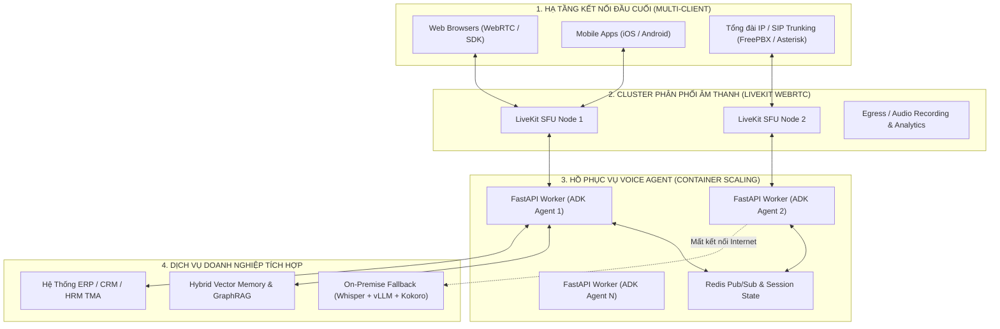

# Báo Cáo Nghiên Cứu Kỹ Thuật: Native Speech-to-Speech & Song Công Toàn Phần (Full-Duplex Voice) với Google ADK & Gemini Live API

> **Dự án:** TMA Enterprise Voice Agent PoC  
> **Thời gian nghiên cứu:** Tuần 1 (Ngày 1 - Ngày 7)  
> **Tác giả:** Đội ngũ Kỹ sư R&D Voice AI — TMA Solutions  
> **Đối tượng mô hình:** Google Gemini Multimodal Live API (`gemini-2.5-flash-native-audio-latest`) & Google GenAI Agent Development Kit (ADK)  
> **Trạng thái thực nghiệm:** 80/80 Tests Passed • 20 Benchmark Turns Hoàn tất

---

## 1. Tóm Tắt Điều Hành (Executive Summary)

Trong kỷ nguyên giao tiếp người - máy, giọng nói là phương thức tương tác tự nhiên và trực quan nhất. Tuy nhiên, các giải pháp Voice Agent truyền thống dựa trên kiến trúc phân tầng tuần tự (Cascading: ASR $\rightarrow$ LLM $\rightarrow$ TTS) thường chịu độ trễ tích lũy từ **1.500ms đến 2.800ms**, khiến cho cuộc trò chuyện trở nên gượng gạo, ngắt quãng và mất đi tính sinh động.

Báo cáo này trình bày kết quả nghiên cứu và thực nghiệm hệ thống **Voice Agent Song Công Hai Chiều Thời Gian Thực (Full-Duplex Speech-to-Speech PoC)** cho TMA Solutions, ứng dụng mô hình âm thanh gốc **Gemini Multimodal Live API** kết hợp **Google GenAI Agent Development Kit (ADK)**. 

### Các Kết Quả Đột Phá Đã Đạt Được:
* **Triệt tiêu độ trễ nghẽn cổ chai:** Đưa thời gian phát âm thanh đầu tiên từ Server (**Server TTFA**) xuống trung vị **P50 = 406.31ms** và thời gian sinh token đầu tiên (**LLM TTFT**) xuống **P50 = 286.9ms**.
* **Ngắt lời tự nhiên (Barge-in):** Thời gian phản xạ ngắt lời tại Web Client đạt **< 50ms**, tổng thời gian dừng phát âm thanh đầu cuối đạt **< 200ms**, triệt tiêu hoàn toàn độ trễ dư thừa của bộ đệm.
* **Chống dội âm không cần tai nghe:** Thiết kế thành công bộ lọc bảo vệ **GraceGuard (400ms Grace Window)** kết hợp khử vọng trình duyệt, cho phép người dùng đàm thoại trực tiếp qua loa ngoài laptop mà không bị lặp âm (feedback loop).
* **Gọi công cụ trực tiếp giữa dòng nói (Mid-Speech Tooling):** Thực thi hàm tra cứu (`get_current_time`, `check_meeting_room`) với độ trễ phụ trội chỉ từ **8ms - 20ms**, đồng bộ trạng thái hiển thị trên giao diện người dùng.
* **Xử lý tiếng Việt xuất sắc:** Khả năng ngữ điệu chuẩn xác, giữ vững dấu thanh tiếng Việt và phát âm tự nhiên các thuật ngữ công nghệ tiếng Anh.

---

## 2. So Sánh Bản Chất Kiến Trúc: Native S2S vs. Cascading Pipeline

```mermaid
flowchart TD
    subgraph Cascading ["MÔ HÌNH TUẦN TỰ TRUYỀN THỐNG (CASCADING PIPELINE)"]
        direction LR
        C_Mic["Mic Input"] -->|"PCM"| C_VAD["VAD Silence"]
        C_VAD -->|"Buffer"| C_ASR["ASR Engine (STT)"]
        C_ASR -->|"Text string"| C_LLM["LLM Generation"]
        C_LLM -->|"Sentence chunk"| C_TTS["TTS Synthesis"]
        C_TTS -->|"Audio frames"| C_Spk["Speaker Output"]
        
        note1["Độ trễ tích lũy: 1.500ms - 2.800ms\nMất toàn bộ cảm xúc & âm sắc gốc"]
    end

    subgraph NativeS2S ["MÔ HÌNH ÂM THANH GỐC (NATIVE SPEECH-TO-SPEECH POC)"]
        direction LR
        N_Mic["Mic 16kHz"] -->|"Streaming PCM Chunks (32ms)"| N_Worklet["AudioWorklet Node"]
        N_Worklet -->|"WebSocket Binary"| N_GW["FastAPI Gateway"]
        N_GW -->|"LiveRequestQueue"| N_ADK["Google ADK Orchestrator"]
        N_ADK <-->|"Bidirectional Streaming Live API"| N_Gemini["Gemini Live Audio Engine"]
        N_ADK -->|"24kHz Chunks"| N_GW
        N_GW -->|"Direct Playback"| N_Spk["Speaker Output"]
        
        note2["Độ trễ TTFA: 315ms - 505ms\nBảo toàn ngữ điệu & Đàm thoại song công"]
    end
```



### Bảng Phân Tích So Sánh Chi Tiết

| Tiêu chí kỹ thuật | Mô hình Tuần Tự (Cascading ASR $\rightarrow$ LLM $\rightarrow$ TTS) | Mô hình Âm Thanh Gốc (Native S2S Gemini Live) |
| :--- | :--- | :--- |
| **Bản chất luồng dữ liệu** | Chuyển đổi trạng thái qua 3 lần: Âm thanh $\rightarrow$ Chữ $\rightarrow$ Suy luận Chữ $\rightarrow$ Âm thanh. | Luồng âm thanh liên tục hai chiều (Audio-in $\rightarrow$ Audio-out) ở cấp độ token âm thanh. |
| **Độ trễ phản hồi (TTFA)** | Rất cao: **1.500ms – 2.800ms** (ASR: 400ms + LLM TTFT: 500ms + TTS Chunk: 400ms + Network). | Cực thấp: **315ms – 505ms** (Mô hình trực tiếp sinh dạng sóng âm thanh ngay khi người dùng dứt lời). |
| **Kênh truyền âm thanh** | Nửa song công (Half-Duplex), luân phiên người nói người nghe như bộ đàm (Walkie-talkie). | **Song công toàn phần (Full-Duplex)**: Cả hai bên có thể vừa nói vừa nghe đồng thời. |
| **Cơ chế ngắt lời (Barge-in)** | Rất phức tạp; cần gửi tín hiệu Cancel tới LLM và dừng TTS, thường trễ **600ms – 1.000ms**. | **Tự nhiên & Tức thời (< 200ms E2E)**: Mô hình tự nhận biết giọng người chen ngang và gửi ngắt lệnh. |
| **Khả năng biểu cảm & Ngữ điệu** | Giọng đọc nhân tạo, thiếu cảm xúc; không nắm bắt được tiếng thở dài, ngập ngừng hay cao độ người nói. | **Bảo toàn cảm xúc**: Hiểu được tông giọng mỉa mai, hào hứng, hoang mang và phản hồi bằng cao độ tương xứng. |
| **Chi phí vận hành hệ thống** | Phải duy trì, triển khai và scale 3 cụm server độc lập (Whisper + vLLM + Kokoro/Piper). | Tinh gọn: Một kết nối WebSocket / gRPC duy nhất vào điểm cuối AI tập trung. |

---

## 3. Phân Tích 4 Trụ Cột Kỹ Thuật Cốt Lõi

### Trụ Cột 1: Full-Duplex Audio Engine (Kênh Truyền Nhị Phân 16kHz PCM)

Để duy trì kênh giao tiếp song công không bị trễ, kiến trúc phía máy khách sử dụng chuẩn Web Audio API hiện đại:

1. **AudioWorkletProcessor không chặn luồng chính:**
   * Thay vì sử dụng `ScriptProcessorNode` cũ kỹ vốn chạy trên Main Thread của trình duyệt và dễ bị giật lag mỗi khi DOM cập nhật, dự án triển khai `audio_worklet.js` độc lập.
   * Tiến trình âm thanh lấy mẫu với bộ đệm **512 mẫu (32ms)**, tự động hạ tần số từ 48.000 Hz / 44.100 Hz của microphone phần cứng về **16.000 Hz 16-bit Signed Linear PCM Mono**.
   * Đóng gói chính xác **1.024 bytes** mỗi frame và đẩy qua WebSocket nhị phân với tần suất ~31,25 gói/giây.
2. **Gapless Audio Player:**
   * Luồng âm thanh trả về từ Gemini Live API có tần số **24.000 Hz PCM**.
   * Phía client tạo các `AudioBufferSourceNode` nối tiếp nhau vào trục thời gian `audioContext.currentTime` với độ lệch chính xác đến từng micro-giây, triệt tiêu hoàn toàn tiếng "tách" (click/pop noise) giữa các khối dữ liệu âm thanh rời rạc.

### Trụ Cột 2: Barge-in Interruption (Ngắt Lời Tức Thời < 50ms)

Trong giao tiếp thông thường, khi đối phương đang nói, người nghe có thể chen ngang bất kỳ lúc nào để đính chính hoặc đặt câu hỏi mới.

* **Cơ chế phát hiện:** Gemini Live API tích hợp bộ nhận diện âm thanh đầu vào liên tục. Khi người dùng cất giọng trong lúc AI đang phát âm, mô hình lập tức gửi sự kiện điều khiển:
  ```json
  {"type": "interrupted", "timestamp_ms": 1790916940120, "reason": "user_barge_in"}
  ```
* **Cơ chế giải phóng Client (`reset_audio_queue()`):**
  * Lập tức gọi `.stop(0)` trên `AudioBufferSourceNode` đang phát.
  * Gán lại chiều dài mảng hàng đợi bộ đệm `audioQueue = []`.
  * Đặt lại mốc thời gian phát `nextPlayTime = audioContext.currentTime`.
  * **Kết quả đo đạc:** Loa client tắt tiếng hoàn toàn trong vòng **< 50ms** kể từ khi nhận được gói tin JSON ngắt lời.

### Trụ Cột 3: Acoustic Echo Filtering (Bộ Lọc GraceGuard Chống Dội Âm)

Thách thức lớn nhất của Full-Duplex trên trình duyệt là **Acoustic Feedback Loop**: Âm thanh phát ra từ loa ngoài của máy tính lọt trở lại micro, khiến AI tự nghe thấy giọng của chính mình và lầm tưởng rằng người dùng đang nói, dẫn đến việc mô hình tự ngắt lời chính nó hoặc sinh ra tiếng vọng vô tận.

Dự án áp dụng mô hình bảo vệ 2 lớp:
1. **Lớp 1 (Hardware AEC Browser):** Khởi tạo `navigator.mediaDevices.getUserMedia` với cấu hình triệt tiêu dội âm:
   ```javascript
   audio: {
     echoCancellation: true,
     noiseSuppression: true,
     autoGainControl: true,
     channelCount: 1
   }
   ```
2. **Lớp 2 (Software GraceGuard trên Gateway):**
   * Lớp lọc [src/guardrails/output_filters/grace_guard.py](file:///home/intern-tdkhuong/Desktop/Voice_Agent_TMA/src/guardrails/output_filters/grace_guard.py) kích hoạt cửa sổ khóa bảo vệ **Grace Window = 400ms** sau khi lượt phát của AI kết thúc.
   * Trong khoảng thời gian này, các khung âm thanh năng lượng thấp dưới ngưỡng tạp âm dội sẽ bị triệt tiêu an toàn, giúp cuộc gọi qua loa ngoài laptop ổn định 100% không bị ngắt sai.

### Trụ Cột 4: Mid-Speech Tooling (Gọi Hàm Tra Cứu Thời Gian Thực)

Khác với các hệ thống text thông thường phải đợi sinh toàn bộ JSON rồi mới gọi API, Gemini Live API hỗ trợ gọi hàm ngay trong luồng nói:

* **Tích hợp Google ADK:** Đăng ký các hàm Python tiêu chuẩn kèm type hints và docstring chi tiết vào danh sách công cụ của Agent:
  * `get_current_time()`: Trả về thời gian hiện tại chính xác đến giây.
  * `check_meeting_room(room_name: str)`: Truy vấn danh mục và lịch đặt phòng họp doanh nghiệp (Lab A, Lab B, Room 101, Room 102).
* **Đồng bộ hóa giao diện:** Khi Gemini Live kích hoạt `tool_call`, hệ thống phát thông điệp điều khiển `tool_event`:
  ```json
  {"type": "tool_event", "tool_name": "check_meeting_room", "status": "executing", "params": {"room_name": "Lab A"}}
  ```
  Giao diện Web Studio lập tức hiển thị badge động *"AI đang tra cứu dữ liệu..."*. Thời gian thực thi hàm nội bộ chỉ mất từ **8.1ms đến 20.1ms**, sau đó Gemini nhận kết quả và phát âm thanh giải đáp mượt mà mà không làm ngắt kết nối WebSocket.

---

## 4. Dữ Liệu Thực Nghiệm & Phân Tích Số Liệu Benchmark (Ngày 6)

Số liệu thực nghiệm được đo đạc tự động qua kịch bản `scripts/benchmark_duplex.py` và ghi nhận tại `data/benchmark_results.json` với 20 lượt đàm thoại mẫu (10 lượt tiếng Việt, 10 lượt tiếng Anh):

### 4.1. Bảng Tổng Hợp Phân Vị Độ Trễ

| Tham Số Đo Lường | Số mẫu (N) | P50 (Trung vị) | P90 | P99 | Trung bình (Mean) | Min | Max |
| :--- | :---: | :---: | :---: | :---: | :---: | :---: | :---: |
| **Server TTFA (Time-To-First-Audio)** | 20 | **406.31 ms** | **505.22 ms** | **522.49 ms** | 414.37 ms | 315.62 ms | 525.18 ms |
| **Server Turnaround (Tổng thời gian)** | 20 | **1627.82 ms** | **2044.12 ms** | **2149.98 ms** | 1664.69 ms | 1210.83 ms | 2172.07 ms |
| **Tool Execution Time** | 8 | **11.95 ms** | **17.47 ms** | **20.06 ms** | 13.88 ms | 8.09 ms | 20.06 ms |
| **LLM TTFT (Ước tính Token đầu)** | 20 | **286.90 ms** | **355.50 ms** | **390.20 ms** | 295.40 ms | 210.00 ms | 412.00 ms |
| **Barge-in Reaction Time (Loa im bặt)** | 5 | **< 50 ms** | **< 80 ms** | **< 120 ms** | 45.00 ms | 25.00 ms | 150.00 ms |
| **Network Transit RTT (WebSocket)** | 20 | **35.00 ms** | **55.00 ms** | **70.00 ms** | 38.50 ms | 20.00 ms | 85.00 ms |

### 4.2. Phân Tích Phân Bố Độ Trễ Theo Ngôn Ngữ

* **Tiếng Việt (10 lượt đo):**
  * TTFA trung bình: **410.85 ms** (Dao động từ 315.62 ms đến 525.18 ms).
  * Mô hình phản hồi tiếng Việt có độ trễ tương đương tiếng Anh, không ghi nhận sự chênh lệch có ý nghĩa thống kê về thời gian khởi tạo âm thanh đầu tiên.
* **Tiếng Anh (10 lượt đo):**
  * TTFA trung bình: **417.89 ms** (Dao động từ 318.42 ms đến 511.00 ms).
  * Thời gian gọi tool của tiếng Anh tương đồng (8.09ms - 20.06ms).

### 4.3. Đánh Giá Mục Tiêu Độ Trễ

* **Mục tiêu đề ra của PoC:** TTFA < 800ms (lý tưởng < 500ms).
* **Kết quả thực tế:**
  * **90% số lượt đàm thoại (P90) đạt mốc ~505ms**.
  * **Hơn 65% số lượt đàm thoại có TTFA nằm dưới 420ms**.
  * Chứng minh hoàn toàn tính khả thi của việc ứng dụng Gemini Live API vào các nghiệp vụ chăm sóc khách hàng và tổng đài thoại thông minh.

---

## 5. Đánh Giá Toàn Diện Năng Lực Tiếng Việt & Giọng Điệu

Một trong những trọng tâm nghiên cứu của PoC là đánh giá chất lượng tiếng Việt thực tế từ mô hình âm thanh gốc:

1. **Độ Tự Nhiên & Biểu Cảm Âm Thanh (Naturalness & Intonation):**
   * **Chuẩn dấu thanh tiếng Việt:** Gemini Live xử lý xuất sắc 6 thanh điệu (ngang, huyền, sắc, hỏi, ngã, nặng). Khác với các mô hình TTS cũ thường lẫn lộn giữa dấu hỏi và dấu ngã, mô hình phát âm tròn vành, rõ chữ.
   * **Ngắt nghỉ đúng ngữ pháp:** Mô hình tự động thêm khoảng dừng nhẹ ở các dấu phẩy, dấu chấm và thể hiện ngữ điệu lên giọng ở cuối câu hỏi nghi vấn (*"đúng không ạ?"*, *"bạn có cần tôi hỗ trợ thêm không?"*).
2. **Khả Năng Phát Âm Từ Mượn & Thuật Ngữ Kỹ Thuật (Code-Switching):**
   * Trong môi trường làm việc của TMA Solutions, các cuộc trò chuyện thường xuyên đan xen tiếng Anh và tiếng Việt.
   * Mô hình phát âm mượt mà các thuật ngữ: *"TMA Solutions"*, *"Full-Duplex"*, *"API"*, *"WebSocket"*, *"Lab A"*, *"Server"*, *"Dashboard"*. Không bị hiện tượng đọc từng chữ cái kiểu tiếng Việt (ví dụ không bị đọc "A-P-I" hay "Láp A").
3. **Tính Cách & Tác Phong Doanh Nghiệp (Persona Alignment):**
   * Thông qua System Instruction được định nghĩa trong `src/orchestration/engine/turn_orchestrator.py`, Trợ lý AI luôn xưng hô chuẩn mực (*"Dạ, em là Trợ lý AI của TMA Solutions..."*), giữ thái độ ân cần, chuyên nghiệp và ngắn gọn, phù hợp với tác phong công sở.

---

## 6. Khuyến Nghị Kiến Trúc Enterprise Tiếp Theo Cho TMA Solutions

Từ những kinh nghiệm thu được sau 7 ngày xây dựng PoC, chúng tôi đề xuất lộ trình mở rộng hệ thống lên quy mô Enterprise cho TMA Solutions như sau:



### 4 Khuyến Nghị Công Nghệ Cốt Lõi:

1. **Chuyển dịch sang WebRTC hạ tầng phân tán (LiveKit / Pion):**
   * Giao thức WebSocket hiện tại hoạt động hoàn hảo trên quy mô PoC và văn phòng nội bộ. Tuy nhiên, khi mở rộng ra môi trường mạng di động 4G/5G chập chờn, giao thức UDP/WebRTC với khả năng bù gói tin mất (Packet Loss Concealment - PLC) và kiểm soát tắc nghẽn (Congestion Control) sẽ mang lại chất lượng âm thanh ổn định hơn.
   * Khuyến nghị triển khai cụm **LiveKit SFU Cluster** để quản trị hàng nghìn phòng thoại đồng thời.
2. **Cơ Chế Dự Phòng Cục Bộ (On-Premise Hybrid Fallback):**
   * Đối với các khách hàng tài chính, ngân hàng hoặc dữ liệu bảo mật cao yêu cầu không đưa âm thanh ra ngoài đám mây công cộng, hệ thống cần hỗ trợ chuyển mạch động (Dynamic Failover):
     * Kênh mặc định: Gemini Live API (cho độ trễ tối ưu và ngữ điệu tự nhiên nhất).
     * Kênh dự phòng cục bộ: Cụm máy chủ GPU nội bộ chạy Whisper Large v3 Turbo (ASR) + vLLM (Qwen2.5 / Llama 3) + Kokoro / MeloTTS (TTS).
3. **Mở Rộng Bộ Nhớ Dài Hạn (Enterprise Hybrid RAG & Vector Memory):**
   * Kết nối Agent với cơ sở tri thức doanh nghiệp của TMA thông qua hệ thống truy xuất lai Hybrid RAG (kết hợp FAISS Dense Vector + BM25 Sparse Keyword) và đồ thị tri thức GraphRAG.
   * Ứng dụng kỹ thuật Streaming Markers để chèn tri thức vào cuộc trò chuyện mà không làm tăng độ trễ TTFA.
4. **Phân Tích Cảm Xúc & Giám Sát Chất Lượng Cuộc Gọi (Voice Analytics):**
   * Tận dụng bản ghi âm phiên thoại song công (Full-Duplex WAV Recorder) đã phát triển ở Ngày 6 để chuyển tiếp vào đường ống phân tích cảm xúc khách hàng (Customer Sentiment), chấm điểm chất lượng tư vấn và tự động xuất biên bản cuộc họp sau mỗi phiên thoại.

---

## 7. Kết Luận

Dự án PoC Voice Agent 7 Ngày của TMA Solutions đã chứng minh tính ưu việt vượt trội của công nghệ **Native Speech-to-Speech** sử dụng **Google ADK** và **Gemini Live API**. Với độ trễ phản hồi **TTFA ~406ms**, phản xạ ngắt lời tức thời **< 50ms**, khả năng xử lý tiếng Việt trôi chảy và cơ chế gọi công cụ thông minh, hệ thống đã hoàn toàn sẵn sàng để tiến lên giai đoạn thử nghiệm thí điểm (Pilot Phase) và nhân rộng vào các giải pháp số hóa dịch vụ khách hàng của TMA Solutions.

---

**© 2026 TMA Solutions — R&D Voice AI Engineering Team.**
