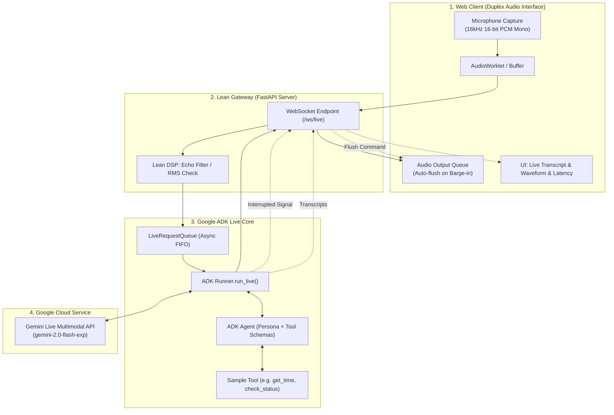
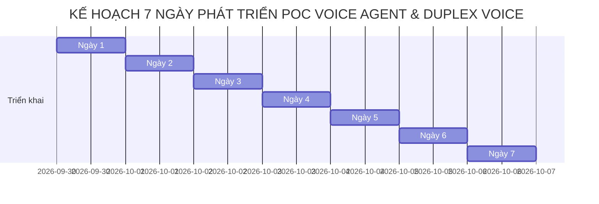

# Kế Hoạch Nghiên Cứu & Xây Dựng Mẫu Thử Nghiệm (PoC) Voice Agent Speech-to-Speech Với Google ADK & Duplex Voice (1 Tuần)

> **Loại dự án:** Nghiên cứu kỹ thuật (Spike / PoC) & Xây dựng mẫu thử nghiệm nhanh
> **Thời gian thực hiện:** **1 Tuần (7 Ngày làm việc)**
> **Trọng tâm nghiên cứu:** **Duplex Voice (Hội thoại hai chiều toàn phần), Cơ chế ngắt lời (Barge-in), Độ trễ phản hồi (TTFA) và Native Speech-to-Speech với Google ADK & Gemini Live API**
> **Phiên bản:** 2.0.0 (Lean PoC)
> **Cập nhật:** 2026-09-29

---

## Mục Lục

1. [Phân Tích Đầu Vào &amp; Mục Tiêu Nghiên Cứu (1 Tuần)](#1-phân-tích-đầu-vào--mục-tiêu-nghiên-cứu-1-tuần)
2. [Tái Định Hình Kiến Trúc: Tinh Gọn Cho PoC (Lean Architecture)](#2-tái-định-hình-kiến-trúc-tinh-gọn-cho-poc-lean-architecture)
3. [Các Vấn Đề Kỹ Thuật Trọng Tâm Về Duplex Voice](#3-các-vấn-đề-kỹ-thuật-trọng-tâm-về-duplex-voice)
4. [Kế Hoạch Chi Tiết 7 Ngày (Day-by-Day Sprint Plan)](#4-kế-hoạch-chi-tiết-7-ngày-day-by-day-sprint-plan)
   - [Ngày 1: Thiết Lập Môi Trường &amp; Script S2S Hello-World](#ngày-1-thiết-lập-môi-trường--script-s2s-hello-world)
   - [Ngày 2: Gateway WebSocket Full-Duplex PCM 16kHz](#ngày-2-gateway-websocket-full-duplex-pcm-16khz)
   - [Ngày 3: Xây Dựng Giao Diện Web Test Duplex Voice (AudioWorklet)](#ngày-3-xây-dựng-giao-diện-web-test-duplex-voice-audioworklet)
   - [Ngày 4: Nghiên Cứu Chuyên Sâu Barge-in &amp; Chống Dội Âm (AEC/Grace)](#ngày-4-nghiên-cứu-chuyên-sâu-barge-in--chống-dội-âm-aecgrace)
   - [Ngày 5: Tích Hợp Tool Calling Giữa Dòng Thoại (Mid-Speech Tooling)](#ngày-5-tích-hợp-tool-calling-giữa-dòng-thoại-mid-speech-tooling)
   - [Ngày 6: Đo Lường Chỉ Số Độ Trễ &amp; Thu Thập Dữ Liệu Nghiên Cứu](#ngày-6-đo-lường-chỉ-số-độ-trễ--thu-thập-dữ-liệu-nghiên-cứu)
   - [Ngày 7: Tổng Kết Báo Cáo Nghiên Cứu, Tinh Chỉnh &amp; Demo](#ngày-7-tổng-kết-báo-cáo-nghiên-cứu-tinh-chỉnh--demo)
5. [Bộ Tiêu Chí Đánh Giá Kỹ Thuật (Benchmark Metrics)](#5-bộ-tiêu-chí-đánh-giá-kỹ-thuật-benchmark-metrics)
6. [Phân Định Phạm Vi (Scope: In vs Out of Scope)](#6-phân-định-phạm-vi-scope-in-vs-out-of-scope)

---

## 1. Phân Tích Đầu Vào & Mục Tiêu Nghiên Cứu (1 Tuần)

### 1.1. Bối cảnh mới & Ràng buộc thời gian

* **Thời lượng:** Đúng **7 ngày**.
* **Bản chất dự án:** Không phải hệ thống Enterprise hoàn chỉnh quy mô lớn, mà là **Mẫu thử nghiệm (PoC)** tập trung giải quyết bài toán cốt lõi: **Duplex Voice tương tác giọng nói hai chiều trực tiếp (Speech-to-Speech)** sử dụng **Google Agent Development Kit (ADK)**.
* **Câu hỏi nghiên cứu cần trả lời sau 1 tuần:**
  1. Google ADK phối hợp với Gemini Live Multimodal API (`gemini-2.0-flash-exp`) hoạt động như thế nào trong môi trường streaming âm thanh hai chiều?
  2. Cơ chế **Duplex Voice** (vừa nói vừa nghe) và **Barge-in** (ngắt lời khi Agent đang nói) phản ứng nhanh đến mức nào?
  3. Độ trễ thực tế từ khi người dùng dứt lời đến khi âm thanh đầu tiên phát ra (Time to First Audio Frame - TTFA) là bao nhiêu mili-giây?
  4. Mô hình có thể gọi công cụ nghiệp vụ (Function Calling) trong lúc đang duy trì dòng đàm thoại âm thanh mà không làm gãy kết nối không?
  5. Những thách thức âm học thực tế (Acoustic Echo, Feedback loop, dội âm loa-mic) cần xử lý như thế nào ở tầng client/gateway?

### 1.2. Mục tiêu kỹ thuật đạt được (Success Criteria)

1. **Một ứng dụng Web/PoC chạy được hoàn chỉnh:** Người dùng mở trình duyệt, bật micro và đàm thoại tự nhiên với AI bằng tiếng Việt/tiếng Anh.
2. **Khả năng ngắt lời mượt mà (Barge-in):** Khi Agent đang nói dài, người dùng cất lời chen ngang $\rightarrow$ Agent lập tức im lặng trong vòng < 300ms và lắng nghe câu mới.
3. **Độ trễ thấp:** Đo đạc TTFA trung bình trong khoảng **350ms – 600ms**.
4. **Báo cáo nghiên cứu Duplex Voice:** Đúc kết các phát hiện kỹ thuật, ưu/nhược điểm của Google ADK, và khuyến nghị cho giai đoạn phát triển tiếp theo.

---

## 2. Tái Định Hình Kiến Trúc: Tinh Gọn Cho PoC (Lean Architecture)

Thay vì kích hoạt toàn bộ 7 phân tầng phức tạp của thiết kế Enterprise, chúng ta **đóng băng (Freeze) các thành phần chưa cần thiết** và **tập trung tối đa vào 3 khối cốt lõi**:

### So Sánh Phạm Vi Thay Đổi

| Thành phần                           | Thiết kế Enterprise cũ                  | Thiết kế PoC Tinh gọn 1 Tuần (Lean PoC)                                                                                              |
| :------------------------------------- | :----------------------------------------- | :--------------------------------------------------------------------------------------------------------------------------------------- |
| **Giao thức truyền âm thanh** | WebRTC LiveKit Server + Turn/Stun          | **FastAPI WebSocket hai chiều** truyền trực tiếp PCM nhị phân (gọn nhẹ, không cần dựng hạ tầng WebRTC phức tạp)     |
| **Mô hình giọng nói**        | Whisper.cpp + Piper TTS + vLLM             | **Gemini Live Multimodal API qua Google ADK** (Native S2S trực tiếp)                                                             |
| **Xử lý ngắt lời**           | Tự code VAD + State Machine phức tạp    | Tận dụng cơ chế**Native Interruption của Gemini Live & ADK** + client buffer flush                                            |
| **Cơ sở tri thức (RAG)**      | FAISS + BM25 + Cross-Encoder + GraphRAG    | **Tạm hoãn (Out-of-scope)** để tập trung vào Duplex Audio; chỉ dùng 1-2 Tool Python đơn giản để test function calling |
| **Bộ nhớ & Cơ sở dữ liệu** | 5 tầng bộ nhớ + SQLite + Temporal Graph | **In-memory Session** của Google ADK (đủ cho cuộc gọi thử nghiệm 5-10 phút)                                                |
| **Kiểm thử & Giao diện**      | Two-bot CI simulation + k8s deployment     | **Web Test UI trực quan** (HTML5 + Web Audio API) đo đạc trực tiếp trên trình duyệt                                       |

---

## 3. Các Vấn Đề Kỹ Thuật Trọng Tâm Về Duplex Voice

### 3.1. Full-Duplex Audio Streaming là gì?

Trong giao tiếp thoại truyền thống (Half-Duplex / Bộ đàm), một bên nói thì bên kia phải chờ nói xong hoàn toàn mới được trả lời.**Full-Duplex (Duplex Voice)** cho phép:

* Cả hai bên (Người và AI) vừa truyền âm thanh vừa nhận âm thanh đồng thời qua cùng một kênh kết nối.
* Mô hình liên tục lắng nghe ngay cả trong lúc đang truyền các gói âm thanh phản hồi.

### 3.2. Cơ chế Barge-in (Ngắt lời) & Xử lý Bộ đệm (Buffer Flush)

Thách thức lớn nhất của Duplex Voice là **Độ trễ ngắt lời (Interruption Latency)**:

1. Khi Agent đang phát câu dài: *"Dạ em xin thông báo lịch bảo trì hệ thống vào lúc 10 giờ tối ngày..."*
2. Người dùng ngắt lời: *"Thôi anh biết rồi, cho anh hỏi cái khác!"*
3. **Xử lý phía Server:** Gemini Live phát hiện tiếng người dùng nói chen ngang $\rightarrow$ Dừng sinh âm thanh tiếp theo $\rightarrow$ ADK gửi event `interrupted=True`.
4. **Xử lý phía Client (Tối quan trọng):** Client thường đã nhận sẵn 1-2 giây âm thanh trong bộ đệm phát (Playback Buffer). Nếu Client không lập tức xóa sạch (`audio_source.stop()` / clear queue), Agent sẽ tiếp tục phát hết 1-2 giây âm thanh cũ rồi mới dừng, gây trải nghiệm vô cùng khó chịu! PoC phải xử lý triệt để việc **Clear Playback Queue ngay khi nhận cờ `interrupted`**.

### 3.3. Acoustic Echo & Hiện tượng vòng lặp dội âm (Feedback Loop)

Khi Agent phát âm thanh qua loa ngoài (Speaker) của laptop/điện thoại, âm thanh đó lọt trở lại Micro của thiết bị:

* Nếu không có Acoustic Echo Cancellation (AEC), Gemini sẽ nghe thấy chính giọng của mình và hiểu nhầm là người dùng đang ngắt lời $\rightarrow$ Agent tự ngắt liên tục!
* **Giải pháp trong PoC:**
  1. Khuyến nghị người test đeo tai nghe (Headphones) để triệt tiêu hoàn toàn echo cơ học.
  2. Bật cờ `echoCancellation: true` của trình duyệt Web Audio API.
  3. Áp dụng cơ chế **Grace Window**: Tạm thời hạ độ nhạy hoặc bỏ qua tín hiệu mic trùng với biên độ âm thanh loa vừa phát trong 300ms đầu.

---

## 4. Kế Hoạch Chi Tiết 7 Ngày (Day-by-Day Sprint Plan)

---

### Ngày 1: Thiết Lập Môi Trường & Script S2S Hello-World

* **Mục tiêu:** Cài đặt thư viện, cấu hình Google API Key, và chạy thành công một script Python tối giản kết nối Gemini Live S2S qua Google ADK.
* **Tệp tin tác động:**
  - [pyproject.toml](file:///home/intern-nvnguyen1/Project/Voice_Agent_TMA/pyproject.toml)
  - [config/settings.py](file:///home/intern-nvnguyen1/Project/Voice_Agent_TMA/config/settings.py)
  - `.env`
  - `scripts/hello_adk_live.py` *(tạo mới)*
* **Nhiệm vụ cụ thể:**
  1. Cài đặt các gói: `pip install google-adk google-genai websockets sounddevice numpy pydantic-settings`.
  2. Cấu hình biến môi trường `GOOGLE_API_KEY` và `GEMINI_LIVE_MODEL=gemini-2.0-flash-exp` trong `.env`.
  3. Viết script `scripts/hello_adk_live.py`:
     - Khởi tạo `Agent(name="test_voice_agent", model="gemini-2.0-flash-exp", instruction="You are a helpful voice assistant. Keep answers brief in 1 sentence.")`.
     - Sử dụng `sounddevice` để thu âm một đoạn ngắn từ mic, đẩy vào `LiveRequestQueue` và phát âm thanh phản hồi nhận được từ `runner.run_live()`.
* **Tiêu chí hoàn thành (DoD):**
  - Chạy `python scripts/hello_adk_live.py`, nói vào micro và nghe thấy tiếng Agent phản hồi qua loa.

---

### Ngày 2: Gateway WebSocket Full-Duplex PCM 16kHz

* **Mục tiêu:** Xây dựng endpoint WebSocket hai chiều trên FastAPI có khả năng nhận các gói âm thanh nhị phân liên tục từ client và truyền ngược các gói âm thanh từ ADK Runner về client.
* **Tệp tin tác động:**
  - [src/gateway/transports/websocket_transport.py](file:///home/intern-nvnguyen1/Project/Voice_Agent_TMA/src/gateway/transports/websocket_transport.py)
  - [src/orchestration/engine/turn_orchestrator.py](file:///home/intern-nvnguyen1/Project/Voice_Agent_TMA/src/orchestration/engine/turn_orchestrator.py)
  - [src/serving/main.py](file:///home/intern-nvnguyen1/Project/Voice_Agent_TMA/src/serving/main.py)
* **Nhiệm vụ cụ thể:**
  1. Chuẩn hóa format truyền dẫn: Raw PCM 16-bit, 16000Hz, Mono, chunk size 512 mẫu (~32ms) hoặc 1024 mẫu (~64ms).
  2. Hiện thực hóa `turn_orchestrator.py`:
     - Bao bọc `google.adk.runner.Runner`.
     - Cung cấp phương thức `async def start_live_session(ws_connection)`:
       - Task 1 (Client $\to$ ADK): Đọc binary frames từ WebSocket $\rightarrow$ đẩy vào `LiveRequestQueue`.
       - Task 2 (ADK $\to$ Client): Đọc event từ `runner.run_live()` $\rightarrow$ Nếu có audio chunk thì gửi binary frame qua WebSocket; nếu có transcript/event thì gửi JSON text frame.
  3. Khởi tạo endpoint `@app.websocket("/ws/live")` trong [src/serving/main.py](file:///home/intern-nvnguyen1/Project/Voice_Agent_TMA/src/serving/main.py).
* **Tiêu chí hoàn thành (DoD):**
  - Viết script client kiểm thử giả lập gửi stream audio bytes vào `/ws/live` và nhận về luồng audio bytes không bị nghẽn (non-blocking).

---

### Ngày 3: Xây Dựng Giao Diện Web Test Duplex Voice (AudioWorklet)

* **Mục tiêu:** Xây dựng trang web tương tác người dùng đơn giản nhưng chuẩn mực về Web Audio để kiểm thử trực tiếp đàm thoại hai chiều bằng tai nghe/micro máy tính.
* **Tệp tin tác động:**
  - `web/index.html` *(tạo mới)*
  - `web/audio_worklet.js` *(tạo mới - xử lý buffer mic 16kHz)*
  - `web/app.js` *(tạo mới - quản lý WebSocket, Playback Queue, và UI)*
  - [src/serving/main.py](file:///home/intern-nvnguyen1/Project/Voice_Agent_TMA/src/serving/main.py) *(mount thư mục web)*
* **Nhiệm vụ cụ thể:**
  1. Xây dựng bộ thu âm Micro trên trình duyệt:
     - `navigator.mediaDevices.getUserMedia({ audio: { echoCancellation: true, noiseSuppression: true, sampleRate: 16000 } })`.
     - Dùng `AudioWorklet` chuyển đổi Float32 sang Int16 PCM và gửi nhị phân qua WebSocket.
  2. Xây dựng bộ phát âm thanh thời gian thực (Audio Streaming Player):
     - Dùng `AudioContext` nhận các chunk PCM 16-bit 24kHz/16kHz từ server và xếp hàng phát nối tiếp liên tục (gapless playback).
  3. Thiết kế giao diện trực quan:
     - Nút "Start / Stop Voice Call".
     - Đèn trạng thái kết nối (Connected / Disconnected).
     - Live Waveform hoặc âm lượng mic/loa.
     - Hộp hiển thị Live Transcript (nhận diện câu nói của người dùng & câu trả lời của AI).
* **Tiêu chí hoàn thành (DoD):**
  - Mở `http://localhost:8000/web`, ấn "Start", đàm thoại trực tiếp qua mic/loa trình duyệt mượt mà.

---

### Ngày 4: Nghiên Cứu Chuyên Sâu Barge-in & Chống Dội Âm (AEC/Grace)

* **Mục tiêu:** Hiện thực hóa và tối ưu hóa phản xạ ngắt lời (Barge-in responsiveness), giải quyết hiện tượng AI tự ngắt do dội âm từ loa.
* **Tệp tin tác động:**
  - [src/orchestration/engine/turn_orchestrator.py](file:///home/intern-nvnguyen1/Project/Voice_Agent_TMA/src/orchestration/engine/turn_orchestrator.py)
  - [src/guardrails/output_filters/grace_guard.py](file:///home/intern-nvnguyen1/Project/Voice_Agent_TMA/src/guardrails/output_filters/grace_guard.py)
  - `web/app.js`
* **Nhiệm vụ cụ thể:**
  1. Bắt sự kiện ngắt lời từ Gemini/ADK:
     - Khi model phát hiện user chen ngang, ADK phát sinh tín hiệu `interrupted = True`.
     - Server lập tức gửi thông điệp JSON `{ "type": "interrupted" }` về client.
  2. Xử lý Client Audio Buffer Truncation:
     - Khi `web/app.js` nhận message `interrupted`, lập tức gọi `audioContext.suspend()` hoặc xả sạch toàn bộ audio chunks đang chờ phát trong hàng đợi, dừng ngay lập tức âm thanh đang phát trên loa.
  3. Cài đặt `GraceGuard` phòng chống dội âm:
     - Kiểm tra mức năng lượng RMS của mic trong 400ms sau khi loa vừa phát xong; loại bỏ tín hiệu nếu biên độ quá nhỏ tương đương tiếng vọng phòng.
* **Tiêu chí hoàn thành (DoD):**
  - Người dùng cố tình nói chen ngang khi Agent đang nói câu dài: Âm thanh loa tắt ngay lập tức (< 250ms từ lúc cất tiếng), Agent chuyển sang trạng thái lắng nghe và phản hồi câu mới.

---

### Ngày 5: Tích Hợp Tool Calling Giữa Dòng Thoại (Mid-Speech Tooling)

* **Mục tiêu:** Nghiên cứu hành vi của Google ADK và Gemini Live khi thực thi công cụ nghiệp vụ trong lúc đang duy trì kết nối giọng nói trực tiếp.
* **Tệp tin tác động:**
  - [src/tools/internal/calendar_tool.py](file:///home/intern-nvnguyen1/Project/Voice_Agent_TMA/src/tools/internal/calendar_tool.py)
  - `src/tools/sample_tools.py` *(tạo mới các tool mẫu: get_time, check_weather, get_meeting_room)*
  - [src/orchestration/engine/turn_orchestrator.py](file:///home/intern-nvnguyen1/Project/Voice_Agent_TMA/src/orchestration/engine/turn_orchestrator.py)
* **Nhiệm vụ cụ thể:**
  1. Định nghĩa 2 công cụ Python đơn giản theo format chuẩn của ADK:
     - `get_current_time(timezone: str)`: Trả về giờ hiện tại.
     - `check_room_status(room_name: str)`: Giả lập kiểm tra trạng thái phòng họp (Trống / Đang họp).
  2. Đăng ký tools vào ADK `Agent(..., tools=[get_current_time, check_room_status])`.
  3. Quan sát và ghi nhận hành vi đàm thoại:
     - Gemini xử lý âm thanh như thế nào trong thời gian chờ Tool trả về kết quả?
     - Agent có nói câu đệm tự nhiên không? (*"Để em kiểm tra phòng họp giúp anh nhé..."*)
     - Độ trễ phát sinh khi gọi tool là bao nhiêu?
* **Tiêu chí hoàn thành (DoD):**
  - Người dùng hỏi bằng giọng nói: *"Bây giờ là mấy giờ?"* hoặc *"Phòng họp A có trống không?"* $\rightarrow$ Agent kích hoạt tool thành công và trả lời chính xác bằng giọng nói.

---

### Ngày 6: Đo Lường Chỉ Số Độ Trễ & Thu Thập Dữ Liệu Nghiên Cứu

* **Mục tiêu:** Đo lường các chỉ số định lượng về hiệu năng của mô hình Duplex Voice S2S để phục vụ báo cáo kỹ thuật.
* **Tệp tin tác động:**
  - [src/observability/tracing/pipeline_tracer.py](file:///home/intern-nvnguyen1/Project/Voice_Agent_TMA/src/observability/tracing/pipeline_tracer.py)
  - [src/observability/metrics/latency_collector.py](file:///home/intern-nvnguyen1/Project/Voice_Agent_TMA/src/observability/metrics/latency_collector.py)
  - `scripts/benchmark_duplex.py` *(tạo mới)*
* **Nhiệm vụ cụ thể:**
  1. Cài đặt các mốc đo thời gian (Timestamps):
     - $T_0$: Thời điểm người dùng kết thúc câu nói (User Turn End / VAD Silence).
     - $T_1$: Thời điểm gói âm thanh đầu tiên từ Gemini về đến Gateway (First Audio Chunk Arrived).
     - $T_2$: Thời điểm âm thanh bắt đầu phát ra loa ở Client (Time to First Audio Frame - TTFA = $T_2 - T_0$).
     - $T_{barge}$: Thời gian từ lúc user nói chen ngang đến khi loa tắt hẳn.
  2. Thực hiện 20 lượt đàm thoại mẫu (10 lượt tiếng Việt, 10 lượt tiếng Anh) và ghi nhận bảng dữ liệu trễ: P50, P90, P99.
  3. Đánh giá chất lượng phát âm tiếng Việt, ngữ điệu, và độ ổn định của kết nối WebSocket.
* **Tiêu chí hoàn thành (DoD):**
  - Bảng số liệu benchmark thực tế về độ trễ TTFA và Barge-in Latency được xuất ra file JSON/Markdown.

---

### Ngày 7: Tổng Kết Báo Cáo Nghiên Cứu, Tinh Chỉnh & Demo

* **Mục tiêu:** Đúc kết toàn bộ kết quả nghiên cứu thành tài liệu kỹ thuật, dọn dẹp mã nguồn, và chuẩn bị kịch bản Demo hoàn chỉnh.
* **Tệp tin tác động:**
  - `docs/duplex_voice_research.md` *(tạo mới - Báo cáo kết quả nghiên cứu Duplex Voice)*
  - [README.md](file:///home/intern-nvnguyen1/Project/Voice_Agent_TMA/README.md) *(cập nhật hướng dẫn chạy PoC)*
  - [src/serving/main.py](file:///home/intern-nvnguyen1/Project/Voice_Agent_TMA/src/serving/main.py)
* **Nhiệm vụ cụ thể:**
  1. Viết báo cáo nghiên cứu kỹ thuật `docs/duplex_voice_research.md`:
     - Đánh giá kiến trúc Google ADK cho Duplex Voice: Điểm mạnh, điểm yếu, các giới hạn cần lưu ý.
     - So sánh hiệu năng thực tế giữa Native S2S và Cascading STT-LLM-TTS.
     - Kiến nghị lộ trình nếu phát triển tiếp lên giai đoạn Enterprise.
  2. Hoàn thiện kịch bản Demo 3 phút:
     - Phần 1: Chào hỏi và đối thoại tự nhiên tiếng Việt (Đo độ trễ phản hồi).
     - Phần 2: Thử nghiệm ngắt lời (Barge-in): Người dùng chủ động cắt ngang khi AI đang nói.
     - Phần 3: Thử nghiệm gọi công cụ (Function Calling) bằng giọng nói.
* **Tiêu chí hoàn thành (DoD):**
  - Hệ thống chạy ổn định 100%, có tài liệu báo cáo nghiên cứu đầy đủ số liệu, sẵn sàng trình bày Demo.

---

## 5. Bộ Tiêu Chí Đánh Giá Kỹ Thuật (Benchmark Metrics)

Trong quá trình thử nghiệm 1 tuần, các chỉ số sau sẽ được đo đạc liên tục:

| Chỉ số kỹ thuật                        | Định nghĩa                                                                   |   Ngưỡng mục tiêu (Target)   | Ý nghĩa đối với Duplex Voice                                                             |
| :----------------------------------------- | :------------------------------------------------------------------------------ | :------------------------------: | :-------------------------------------------------------------------------------------------- |
| **TTFA (Time to First Audio Frame)** | Thời gian từ lúc user dứt câu đến khi loa client bắt đầu phát tiếng | **< 600 ms** (P50: ~450ms) | Quyết định độ tự nhiên của cuộc trò chuyện (không có khoảng lặng gượng gạo) |
| **Barge-in Latency**                 | Thời gian từ khi user cất tiếng chen ngang đến khi loa client tắt hẳn   |        **< 300 ms**        | Tránh cảm giác Agent "cố cãi" hoặc "nói đè" lên lời người dùng                  |
| **Buffer Flush Success Rate**        | Tỷ lệ client xóa sạch bộ đệm âm thanh cũ khi nhận lệnh ngắt         |          **100%**          | Không được để lọt âm thanh cũ sau khi đã ngắt lời                                |
| **Tool Execution Latency**           | Thời gian thực thi hàm và trả kết quả về cho Gemini                     |        **< 350 ms**        | Đảm bảo Agent không bị im lặng quá lâu khi đang tra cứu dữ liệu                   |
| **Connection Stability**             | Thời gian duy trì liên tục phiên đàm thoại không rớt WebSocket        |       **> 10 phút**       | Đảm bảo độ tin cậy của kết nối thời gian thực                                      |

---

## 6. Phân Định Phạm Vi (Scope: In vs Out of Scope)

Để đảm bảo hoàn thành dự án chất lượng cao đúng trong **thời hạn 1 tuần**, phạm vi được quy định nghiêm ngặt như sau:

### ✅ Nằm trong phạm vi (In-Scope - Tập trung 100%):

- Tích hợp Google ADK với Gemini Live Multimodal API (`gemini-2.0-flash-exp`).
- Giao thức WebSocket hai chiều truyền nhận PCM 16-bit 16kHz mono.
- Giao diện Web Client thử nghiệm hoàn chỉnh (Web Audio API, AudioWorklet).
- Xử lý ngắt lời hai đầu (Gemini Interruption Detection + Client Audio Buffer Flush).
- Triệt tiêu dội âm cơ bản (Web Audio AEC + Grace Guard).
- Tích hợp 1-2 Tool Python mẫu để kiểm chứng Function Calling giữa dòng thoại.
- Đo lường và xuất báo cáo nghiên cứu thực nghiệm Duplex Voice.

### ❌ Tạm thời hoãn lại (Out-of-Scope cho PoC 1 Tuần):

- *Hạ tầng WebRTC phức tạp (LiveKit/STUN/TURN)*: Thay thế hoàn toàn bằng FastAPI WebSocket nhẹ nhàng và đủ cho PoC.
- *Đường ống STT riêng (Whisper) & TTS riêng (Piper)*: Chỉ dùng Native S2S của Gemini.
- *Đồ thị tri thức GraphRAG & Vector Database FAISS/BM25 lớn*: Hoãn sang giai đoạn sau.
- *Hệ thống Sandboxing MicroVM / Docker Container Runner*: Chưa cần thiết cho PoC.
- *Môi trường CI/CD Two-bot đối kháng tự động*: Thay bằng đo đạc thực nghiệm người dùng thật.
